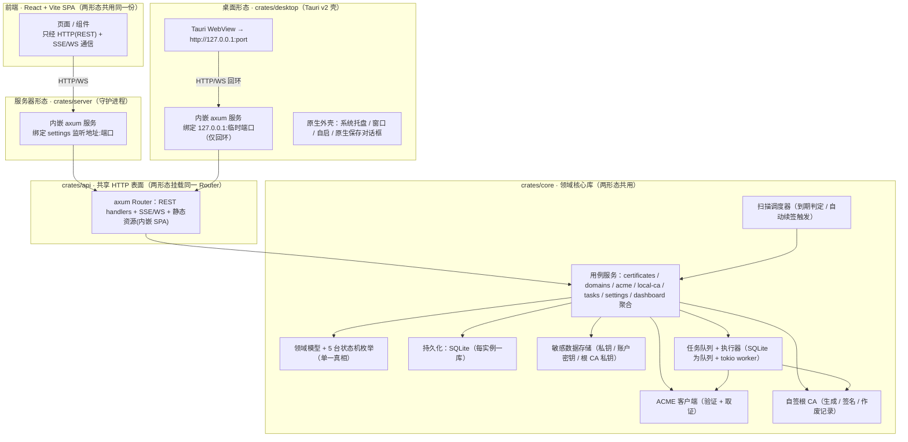
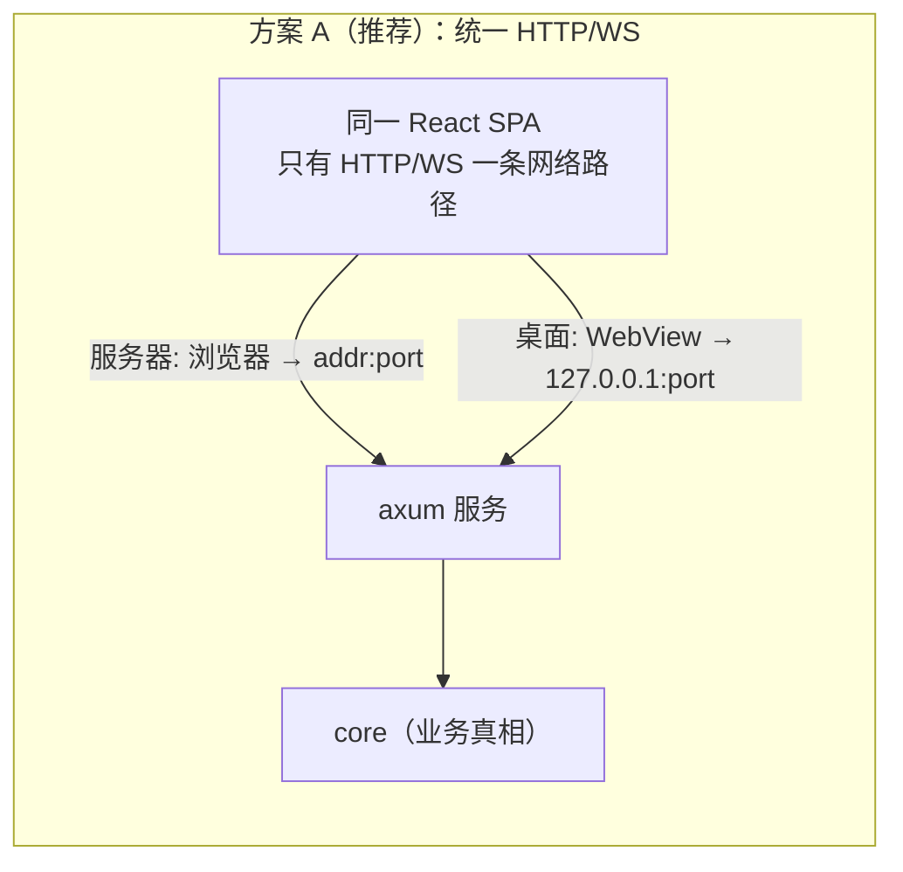
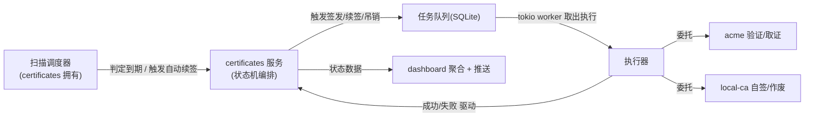

# 系统架构 · autohttps

> 文档状态: draft(待 orchestrator 统一送审)· 层级: 技术基线 · 端点: app · 撰写: architect
> 信任基础: 全部 17 份 PRD 已 approved(2026-07-16)—— project / roles / glossary + 7 flows + 7 模块 PRD;本文件视其为真相直接使用,不复述业务定义。
> 定位: 本文件是**全部代码产物的 DAG 上游**。批准前任何模块不得开工。与 [TECH.md](./TECH.md) 配套:ARCHITECTURE 定"系统怎么搭",TECH 定"用什么技术 + 编码协议"。
> 纪律: 技术选型是用户决策;本文给方案 + 理由,有实质权衡者列入 [TECH.md §2 决策清单]。**§2 决策 1–10 已于 2026-07-16 由 orchestrator 全部确认(采纳 architect 推荐)**;本文相关处已落成"已确认"。本文不设计各模块表结构 / API 契约(基线批准后的下一步)。

---

## 1. 架构总览

autohttps 是一个**单一 Rust 核心 + 单一 React 前端**、以**两种运行形态**(桌面 / 服务器)分别部署的 HTTPS 证书全生命周期管理工具(project §1/§4)。两形态各自独立部署、各持各的数据、互不共享(project §4/§7)。

架构的第一性原理来自 **project §9-D1(端点单端)**:两形态共享同一前端,页面契约只维护一套。为把这一约束贯彻到传输层,本架构令**两形态运行同一套 Rust HTTP+WS 服务**,前端**始终且只**经 HTTP/WS 与之通信(见 §3,最关键决策)。



要点:
- **前端零形态分支**:UI 不感知自己跑在桌面还是服务器,只知道"有一个 HTTP/WS 服务在某个 origin"。形态差异(托盘红点、导出走原生保存 vs 浏览器下载)由后端/外壳承接,前端按运行形态标志做极少量显隐(page PRD 已约定"仅桌面 / 仅服务器"标注)。
- **core 是唯一业务真相**:5 台状态机、枚举、持久化、ACME、CA、任务、扫描全在 `crates/core`;两个可执行形态(server / desktop)只是**外壳 + 传输 + 生命周期宿主**,不重复业务逻辑。
- **单库单实例**:每个部署实例一个 SQLite 库,落于 settings 数据存储路径下;敏感私钥不明文入库(§6 / TECH §2-决策3)。

---

## 2. 组件划分

| 组件 | 路径 | 类型 | 职责 | 依赖 |
| --- | --- | --- | --- | --- |
| 领域核心 | `crates/core` | lib | 领域模型、**5 台状态机枚举(单一真相)**、用例服务、SQLite 持久化、ACME 客户端封装、自签 CA、敏感数据存储、任务队列 + 执行器、扫描调度器。**全部业务真相在此** | — |
| 共享 API 表面 | `crates/api` | lib | axum Router:REST handlers + SSE/WS 推送 + 内嵌 SPA 静态资源;DTO 定义(派生 TS 类型)。**两形态挂载同一个 Router** | core |
| 服务器守护 | `crates/server` | bin | 守护进程宿主:绑定 settings 监听地址:端口,7×24 常驻,承载 tokio 运行时(axum + 任务执行器 + 扫描器);设计为在 OS 服务管理器下被监督自恢复 | core, api |
| 桌面壳 | `crates/desktop` | bin | Tauri v2 宿主:进程内启动 axum(回环)、系统托盘常驻、关窗不退出、单实例、开机自启、原生保存对话框;webview 指向回环服务 | core, api |
| 前端 | `frontend/` | SPA | React + Vite + TypeScript 单页应用,两形态共用;经 HTTP/WS 访问 API;消费 core 导出的 TS 类型/枚举绑定 | (构建产物内嵌进 api) |

> 命名约定沉淀:`crates/core` = 业务真相层,`crates/api` = 传输契约层,`crates/{server,desktop}` = 形态宿主层。三层分离保证"业务只写一遍、传输定义一遍、形态各自装配"。此分层是后续所有 Rust 产物的落位基准(见 [TECH.md §4 枚举单一定义位置])。

---

## 3. 关键架构决策:两形态如何共享一套前端(最关键)

这是本基线**决定后续 API 契约形态**的决策(TECH §2-决策1)。**已确认方案 A(orchestrator, 2026-07-16)**。

### 3.1 推荐方案 A · 统一 HTTP/WS 传输 · 桌面内嵌同一服务

**两形态运行同一个 Rust HTTP+WS 服务(axum)。前端是标准 SPA,永远只经 HTTP(REST)+ SSE/WS(推送)通信。**

- **服务器形态**:`crates/server` 守护进程绑定 settings 的监听地址:端口,对外提供内嵌 SPA 静态资源 + API;浏览器访问 Web UI。
- **桌面形态**:`crates/desktop`(Tauri v2)在进程内启动**同一** axum 服务,绑定 `127.0.0.1:<临时端口>`(仅回环、不可机外访问),Tauri WebView 导航到 `http://127.0.0.1:<port>`。前端代码与网络层**完全相同**;Tauri 只提供原生外壳(托盘、窗口、自启、原生保存对话框)。



**为什么推荐**:
- **单一传输、单一契约**:前端只有一层网络代码(HTTP/WS),无 `invoke()` 与 `fetch()` 的形态分叉;API 契约**只定义一次**(REST + SSE/WS)。直接落实 D1、把契约漂移面降到最低。
- **实时天然统一**:5 台状态机的实时诉求(dashboard 红点、DNS-01 挑战"等待手动配置"待处理提示、任务进度/日志流)统一用 SSE/WS 从同一服务推送,两形态行为一致(见 §9)。
- **离线可用**:桌面回环服务无需外网即可跑(project §7 离线可用);ACME 在线签发才依赖外网,与本地服务解耦。
- **契约形态影响**:据此,下一步 API 契约 = **REST + SSE/WS**,产出于 `docs/architecture/api/app/{模块}.md`。

**回环安全**:桌面服务仅绑 `127.0.0.1`,机外不可达,契合 D4(信任 = 网络可达性)+ 桌面单本机用户信任模型。可选加固(每会话 localhost token)MVP 按 D4 不做应用层鉴权,回环边界即安全边界。

### 3.2 备选方案 B · 双传输(Tauri IPC + HTTP)

前端在桌面走 Tauri `invoke()` 命令 IPC、在服务器走 `fetch()` HTTP,以客户端抽象层屏蔽差异。

- **代价**:两套传输实现 + 两套绑定层(Tauri commands 与 HTTP handlers 各定义一遍),契约实质重复;实时需 Tauri events + WS 两套;漂移面更大——正是 D1 所警惕的"页面契约重复维护"在传输层的翻版。
- **好处**:桌面获 Tauri 原生 IPC(无回环端口、无本地 HTTP 开销、略"更原生"),且可用 tauri-specta 生成强类型命令绑定。
- **连带影响**:若选 B,类型生成改用 specta + tauri-specta(与 IPC 配套,见 TECH §2-决策6)。

### 3.3 结论

**已确认方案 A(orchestrator, 2026-07-16)**。它是"共享一套前端"从页面层贯彻到传输层的唯一低漂移路径,且让 API 契约单一化。后续 API 契约按方案 A 的 REST + SSE/WS 形态展开,不再切换;方案 B 留作记录。

---

## 4. 部署形态与进程模型

两形态是**各自独立的部署实例**(project §4/§9-D1),不共享数据。

### 4.1 服务器形态(守护进程)

| 维度 | 落点 |
| --- | --- |
| 载体 | `crates/server` 可执行文件,前台/后台守护进程 |
| 监听 | 绑定 settings 监听地址:端口(默认仅本机 / 可信内网,project §7);设为对外可达须界面提示公网暴露风险(settings A3 / roles §3) |
| 7×24 常驻 + 异常自恢复 | 进程设计为在 **OS 服务管理器**(Linux systemd / Windows 服务 / macOS launchd)下运行,由其在硬崩溃后拉起(`Restart=always` 类语义);进程内 tokio 任务 panic 相互隔离,顶层守护 + 启动恢复(§7)兜底"进程重启后任务不卡死"(tasks §3.3) |
| 无托盘 | 红点体现在浏览器内 dashboard(dashboard flow §3.3) |

> 进程自恢复是"OS supervisor 拉起进程 + 进程启动恢复任务"两层协作,不是进程自己"复活"。TECH/交付需给出各平台的服务单元样例(实现期),本基线只锚定该架构位置。

### 4.2 桌面形态(Tauri v2)

| 维度 | 落点 |
| --- | --- |
| 载体 | `crates/desktop` = Tauri v2 应用,主窗口 + 系统托盘 |
| 托盘常驻 / 关窗不退出 | 拦截窗口关闭事件 → 隐藏到托盘而非退出进程;托盘菜单提供显示窗口 / 退出;托盘图标角标承载红点(dashboard §3.3) |
| 单实例 | tauri-plugin-single-instance 保证同一实例只跑一份(避免两份守护抢同一数据库) |
| 开机自启 | tauri-plugin-autostart,对应 settings 开机自启开关(仅桌面) |
| 内嵌服务 | 进程内启动 axum(回环),webview 指向之;任务执行器 + 扫描器同样在桌面进程内运行 |
| 导出 | 私钥 / 证书 / 根 CA 导出经 Tauri 原生保存对话框落本地路径(桌面);服务器形态为浏览器下载 —— 同一后端导出接口,交付通道按形态分流 |

### 4.3 前端打包(两形态共用一份构建产物)

前端由 Vite 一次性构建为静态资源,**内嵌进两个可执行文件**(经 rust-embed 打包进 `crates/api`),axum 以静态资源方式提供。好处:每形态一个自包含可执行文件、离线可用、两形态提供完全相同的 SPA。开发期前端走 Vite dev server + 后端 CORS 放行本地开发源。

---

## 5. 目录结构(cargo workspace + 前端)

```text
autohttps/
├── Cargo.toml                      # cargo workspace 根
├── crates/
│   ├── core/                       # 领域核心库（业务唯一真相）
│   │   └── src/
│   │       ├── domain/             # 领域模型 + 5 台状态机枚举（enums.rs 单一定义、导出 TS）
│   │       ├── persistence/        # SQLite 访问层 + 实体 + 迁移（DB 模型落位，路径见 TECH §1/§4）
│   │       ├── acme/               # ACME 客户端封装（账户 + 挑战 + 取证）
│   │       ├── ca/                 # 自签根 CA（密钥生成 / 签名 / 作废记录）
│   │       ├── secrets/            # 敏感数据存储（加密静态存储 / OS keychain，见 TECH §2-决策3）
│   │       ├── tasks/              # 任务队列 + tokio 执行器 + 启动恢复
│   │       ├── scan/               # 扫描调度器（证书 / 根 CA 到期判定、自动续签触发）
│   │       └── services/           # 各模块用例服务（编排状态机流转）
│   ├── api/                        # 共享 HTTP 表面：axum Router + handlers + DTO(派生 TS) + SSE/WS + 内嵌 SPA
│   ├── server/                     # bin：服务器守护进程
│   └── desktop/                    # bin：Tauri v2 桌面壳（含 tauri.conf、图标、权限）
├── frontend/                       # React + Vite + TS SPA（两形态共用）
│   └── src/
│       ├── bindings/               # 由 core 生成的 TS 类型/枚举绑定（勿手改，见 TECH §4）
│       ├── api/                    # 单一 HTTP/WS 客户端层（react-query hooks + SSE）
│       ├── components/ui/          # shadcn/ui 手写组件（遵 v4/React19 约定；设计 token 归 designer）
│       ├── stores/                 # zustand 客户端/UI 态（不含服务端数据，见 TECH §1.4）
│       ├── pages/                  # 对应 pages/app/{模块}/{页面}
│       └── ...
├── docs/
│   ├── prd/                        # 上游 PRD（approved）
│   └── architecture/               # 本层产出
│       ├── database/{模块}.md       # DB 文档（字段说明 + Mermaid 关系图）——基线批准后逐模块产出
│       └── api/app/{模块}.md        # API 契约（REST + SSE/WS）——基线批准后逐模块产出
├── ARCHITECTURE.md                 # 本文件
└── TECH.md                         # 技术选型 + 编码协议
```

> 具体技术栈(ORM / 加密 / ACME / CA / 类型生成等)见 TECH.md;上表只锚定**架构落位**,不锚定库(库属选型,已于 TECH §1/§2 确认)。DB 模型的**确切路径与技术**随 TECH.md 基线定,本文给出 `crates/core/src/persistence/` 的落位约定。

---

## 6. 任务队列 + 扫描调度器的架构位置

两者都在 `crates/core`,是"证书主线自动化"的两个引擎,均在**每个形态进程内**运行(桌面进程与守护进程各跑一套,因数据各自独立)。

### 6.1 任务队列 + 执行器(tasks)

- **队列即数据表**:任务状态机(`queued / running / succeeded / failed / cancelled`,tasks flow §3)本身就是持久队列——`queued` 行即待办队列,无需外部队列中间件。天然持久化、天然可查历史、天然崩溃可恢复。
- **执行器**:tokio 异步 worker,以有界并发(信号量,上限属实现、architect 定)从 `queued` 取任务 → `running` → 委托 acme 验证 / 委托 local-ca 自签 / 与 CA 交互吊销 → `succeeded` / `failed`,并按 tasks §4 联动驱动证书状态。
- **触发来源单一**:任务只由 certificates 触发或对失败任务重试派生(tasks DEC5);执行器不自建触发。
- **重试 = 派生新任务**(tasks DT1),不回炉;执行器据此写重试链。
- **无独立重试参数**:自动再尝试依附扫描器(下)+ settings 自动续签开关(settings SF2 / tasks DT5),执行器不持重试计时器。

> 备选:引入 apalis 等任务框架。但其内建重试/调度模型与 PRD"任务不持重试参数、自动再尝试依附扫描"(SF2/DT5)相抵,反增适配成本;推荐自建轻量队列。列 TECH §2-决策7。

### 6.2 扫描调度器(certificates 拥有)

- **归属**:扫描器是 certificates 的能力(certificates flow §1.1;tasks 明确不持扫描器,DT5)。一个 tokio 周期任务:
  - 启动即全量扫描(project §7 启动即检测,见 §7);
  - 周期扫描:驱动 `valid → expiring_soon`(T6)、`expiring_soon → expired`(T10)、根 CA `active → expired`(local-ca L3);
  - 依 settings 自动续签开关,对"即将到期"发起续签、对"续签失败且未过期"再尝试续签(触发 tasks 建新续签任务)。
- **周期不可配**:扫描周期属实现机制,settings 不暴露旋钮(settings SF3);architect 定合理默认。

### 6.3 二者协作



---

## 7. 启动即检测 + 崩溃恢复的落点

两者都是 **core 的 boot 序列**,由 server / desktop 两个 bin 在进程启动时统一调用(同一段 core 代码,形态无差异)。

**boot 序列(进程启动 → 开始服务前):**
1. **任务崩溃恢复**(tasks §3.3 业务底线:进行中/排队任务不得永久卡死):
   - 对上一进程遗留在 `queued` 的任务:重新纳入队列执行。
   - 对遗留在 `running` 的任务(进程在执行中崩溃):**校正为 `failed`(可重试)**——因客户端无法确知在途 CA 操作是否已在对端生效(tasks DT2 尽力而为),置失败最诚实且不卡死;实际结果由随后的证书扫描据实校正(DT2 扫描校正)。
   - > 具体恢复策略(能否续跑在途执行)是实现细节由 architect 定,业务底线是"不卡死、可被 operator 看到并处置";本基线取"running→failed 可重试 + 扫描校正"为默认策略,列 TECH §2-决策7。
2. **启动即检测全量扫描**(project §7):certificates 立即扫描全部证书 → 驱动 T6/T10 到应有状态;local-ca 扫描全部根 CA → 驱动 L3;dashboard 首屏读取扫描后的最新状态。
3. 依 settings 自动续签开关,对扫描判定为"即将到期 / 续签失败未过期"的证书发起自动续签(经任务队列)。
4. 启动 axum 服务 + 扫描周期任务 + 任务执行器 → 开始对外服务。

> 崩溃恢复分两层:**进程级**(OS supervisor 拉起崩溃的守护进程 / 桌面单实例保证不重复;§4)+ **任务级**(上面 boot 序列第 1 步)。两层缺一不可:OS 拉起进程,进程恢复任务。

---

## 8. 5 台状态机在架构中的落点

5 台状态机是全系统类型/枚举的核心。架构落点如下(枚举的单一定义机制见 TECH §4):

| 状态机 | 归属模块 | 枚举(标识严格照 PRD) | 谁驱动流转 |
| --- | --- | --- | --- |
| 证书状态机(10 态) | certificates | `pending_issue / issuing / issue_failed / valid / expiring_soon / renewing / renewal_failed / expired / revoking / revoked` | certificates 服务(编排)+ 任务执行器结果(T1–T20)+ 扫描器(T6/T10)+ 取消回退(T21–T24) |
| 任务状态机(5 态) | tasks | `queued / running / succeeded / failed / cancelled` | 任务执行器(TT1–TT7) |
| ACME 账户状态机(4 态) | acme | `unconfigured / registering / registered / registration_failed` | acme 服务(AT1–AT5) |
| 验证挑战状态机(6 态) | acme | `pending / awaiting_manual / validating / passed / failed / cancelled` | acme 服务 + 任务执行器 + operator 手动确认(CT1–CT10) |
| 根 CA 状态机(2 态) | local-ca | `active / expired` | local-ca 服务(L1/L2)+ 扫描器(L3) |

附:任务类型 `issue / renew / revoke`、触发方式 `manual / auto / cleanup`、运行形态 `desktop / server`(运行时探测,非持久)等字典枚举同样在 core 单一定义、导出 TS。

- 全部枚举在 `crates/core/src/domain/enums.rs` **单一定义**,序列化为 PRD 指定的 snake_case 标识,经 ts-rs 导出到 `frontend/src/bindings/`(见 TECH §4)。
- 状态机的**流转规则**由 core 服务层以代码强制(非散落校验);任务→证书的联动(tasks §4)在执行器完成一次执行后集中触发,保证"证书状态机是唯一真相"。

---

## 9. 数据流与实时刷新

### 9.1 读路径(聚合视图)

dashboard 是纯聚合、只读(dashboard DD1):它经 API 读 certificates 的证书状态 + tasks 的最近任务概况,聚合出三指标 + 待处理清单 + 红点。刷新要求仅为"呈现与证书当前状态一致"(dashboard §5),机制由 architect 定。

### 9.2 实时刷新机制(dashboard 红点 · TECH §2-决策8)

- **推荐**:**SSE(Server-Sent Events)服务端推送 + 轮询兜底**。当扫描器推进状态、任务执行完成、或 DNS-01 挑战进入"等待手动配置"时,服务端经 SSE 向前端推送"状态已变"事件,前端刷新聚合;若 SSE 连接不可用则回退到低频轮询。
  - 为什么 SSE:状态推送是**单向**(服务端 → 前端)诉求,SSE 原生 `EventSource`、自动重连、经 axum 实现简单、经回环与浏览器都通,足够覆盖红点 / 待处理 / 任务进度。
- **备选**:WebSocket(双向,若后续需前端 → 服务端流式交互再上)/ 纯轮询(最简但实时性差、空转多)。
- 两形态一致:因统一走同一 axum 服务(§3),SSE/轮询在桌面(回环)与服务器(浏览器)行为相同。

---

## 10. 决策清单(指向 TECH.md §2)

以下关键选型曾有实质权衡,**已于 2026-07-16 由 orchestrator 全部确认(采纳 architect 推荐)**;方案 + 备选 + 理由集中在 [TECH.md §2](./TECH.md),此处登记其架构决策身份与最终取定:

1. 两形态传输统一方式(§3)——**已确认:方案 A 统一 HTTP/WS**(桌面内嵌回环),决定 API 契约为 REST + SSE/WS。
2. 本地持久化访问层——**已确认:SQLite + SeaORM 1.x**。
3. 敏感数据静态存储机制——**已确认:加密静态存储(age)为跨形态基线 + 桌面可选叠加 OS keychain 加固**。
4. ACME 客户端库——**已确认:instant-acme 0.8**。
5. X.509 / 自签 CA 库——**已确认:rcgen 0.14(避 openssl 原生依赖)**。
6. Rust↔TS 类型/枚举生成方案——**已确认:ts-rs 12**(随决策 1-A)。
7. 任务队列 + 崩溃恢复策略——**已确认:自建轻量队列(SQLite 表即队列)+ "running→failed 可重试 + queued 重排 + 扫描校正"**。
8. dashboard 实时刷新——**已确认:SSE 推送 + 轮询兜底**(§9.2)。

> 另含低风险项(TECH §2):决策 9 TS 版本线 **已确认 7.0(存疑回退 5.8)**、决策 10 实体 ID **已确认 UUIDv7**。

---

## 11. 架构层边界与非目标(承 project §6.2 / §9)

- ❌ **不做证书自动部署 / 安装**(D3):证书止于签发 + 本地存储 + 导出;无 deploy hook、无写 nginx/apache/系统证书库。
- ❌ **不做应用层鉴权**(D4):无登录 / 会话 / 多用户;信任 = 网络可达性,安全由部署边界保障。架构上不预留鉴权中间件(后置增量)。
- ❌ **不做 HTTP API / CLI 对外自动化集成**(§6.2):MVP 的 HTTP 面服务于自有前端,非对外开放 API 产品。
- ❌ **不做两形态间数据迁移 / 形态切换**(§4/SF4):两实例独立,架构不提供跨实例同步。
- ❌ **不做 DNS-01 厂商 API 自动验证**(§6.2):DNS-01 仅手动,挑战机保留"等待手动配置"态承接。
- ❌ **不做多渠道通知**(§6.2):通知退化为 dashboard 红点 / 高亮,架构不引入邮件/Webhook/IM 通道。
