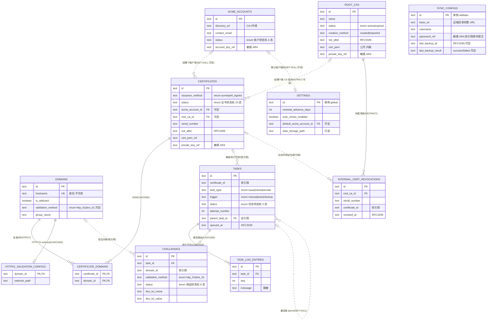

# 数据库设计 · 跨模块总览(_overview)

> 文档状态: draft(待 orchestrator 统一送审)· 层级: 技术契约(DB)· 端点: app · 撰写: architect
> 依据(approved): 7 模块 PRD `§4 数据来源` + 5 台 flows 状态机 · `TECH.md`(SeaORM 1.x / SQLite 每实例一库 WAL / UUIDv7 文本 ID / 枚举 §4.3 / 时间 RFC3339 UTC / 敏感数据 AR4)· `ARCHITECTURE.md`(数据模型落 `crates/core/src/persistence/`)。
> 本文件是**跨模块一致性锚**:全局 ER、关系基数、FK 删除行为、枚举映射、敏感数据落法统一在此;各模块 DB 文档服从本总览。

---

## 1. 全局约定(全表统一)

| 约定 | 取定 | 依据 |
| --- | --- | --- |
| 访问层 | SeaORM 1.x 实体,SQLite,**每实例一库**,WAL;落 `crates/core/src/persistence/` | TECH 决策2 / ARCHITECTURE §5 |
| 主键 | `TEXT·UUIDv7`(领域实体);settings 为单例哨兵、junction 为复合 PK | TECH 决策10 · §3.5(ID 不复用) |
| 枚举列 | core `enums.rs` 单一定义,wire `snake_case` 严格照 **TECH §4.3**;SeaORM `DeriveActiveEnum`(Text) | TECH §4 / AR2 |
| 时间 | `TEXT·RFC3339 UTC`(`time::OffsetDateTime` / SeaORM `TimeDateTimeWithTimeZone`) | TECH §3.5 |
| 审计列 | `created_at` / `updated_at`(全业务表);architect 统一约定 | 本总览 |
| 软删除 | **无**——证书/域名硬删除(退出状态机);任务只增留痕(证书删后只读保留);根 CA/账户 MVP 不删或显式移除 | flows 各模块 |
| 敏感数据 | 私钥/账户密钥/根 CA 私钥/WebDAV 口令**只存 `*_ref` 引用**,密文落数据目录(age),绝不明文入库/入日志 | AR4 / project §7 / L6 |
| 布尔 | `BOOLEAN` = SQLite INTEGER 0/1 | SQLite |

---

## 2. 表总览(12 表 + dashboard 无表)

| # | 表 | 归属模块 | 主键 | 关键外键 / 引用 |
| --- | --- | --- | --- | --- |
| 1 | `certificates` | certificates | `id` UUIDv7 | `acme_account_id`→acme_accounts(SET NULL,可空)· `root_ca_id`→root_cas(RESTRICT,可空) |
| 2 | `certificate_domains` | certificates | `(certificate_id,domain_id)` 复合 | `certificate_id`→certificates(CASCADE)· `domain_id`→domains(RESTRICT) |
| 3 | `domains` | domains | `id` UUIDv7 | (无出向 FK);`hostname` UNIQUE |
| 4 | `acme_accounts` | acme | `id` UUIDv7 | (无出向 FK) |
| 5 | `http01_validation_configs` | acme | `domain_id` | `domain_id`→domains(CASCADE,1:0..1) |
| 6 | `challenges` | acme | `id` UUIDv7 | `task_id`→tasks(CASCADE)· `domain_id` 软引用 domains |
| 7 | `root_cas` | local-ca | `id` UUIDv7 | (无出向 FK) |
| 8 | `internal_cert_revocations` | local-ca | `id` UUIDv7 | `root_ca_id`→root_cas(RESTRICT)· `certificate_id` 软引用 certificates;`(root_ca_id,serial_number)` UNIQUE |
| 9 | `tasks` | tasks | `id` UUIDv7 | `certificate_id` **软引用** certificates · `parent_task_id`→tasks(自引用,SET NULL) |
| 10 | `task_log_entries` | tasks | `id` UUIDv7 | `task_id`→tasks(CASCADE) |
| 11 | `settings` | settings | `id`='global' 单例 | `default_acme_account_id`→acme_accounts(SET NULL,可空) |
| 12 | `sync_configs` | sync | `id`='webdav' 单例 | `password_ref` **软引用** SecretStore 密文(库外) |
| — | (dashboard) | dashboard | 无表 | 纯聚合只读 certificates + tasks(+ 经 certificates 携带 domains) |

---

## 3. 全局 ER 图(全表 + 关系)

> Mermaid 记号:`--` 识别关系(硬 FK,子依赖父)· `..` 非识别关系(可空 FK 或**软引用**)。

---

## 4. 关键关系基数(证书枢纽 4 类 + 其余)

### 4.1 证书枢纽(certificates 为中心的四类关系)

| 关系 | 基数 | 落法 | 依据 |
| --- | --- | --- | --- |
| **证书 ↔ 域名(SAN)** | **多对多** | junction `certificate_domains`(复合 PK);一证多域、**至多一个通配符**(服务层强制);一域可被多证关联 | certificates DEC4 / domains DS4 |
| **证书 ↔ 任务** | **一对多** | `tasks.certificate_id` **软引用**;证书删除后任务历史**只读保留**(不级联),"证书已删除"由证书行是否存在判定 | tasks DEC4 / DT3 / Q2 |
| **证书 ↔ ACME 账户** | **多对一(可空)** | `certificates.acme_account_id` FK(SET NULL);仅 `acme` 方式有值,记"经哪个账户签" | certificates DS3 / acme A5 |
| **证书 ↔ 根 CA** | **多对一(可空)** | `certificates.root_ca_id` FK(RESTRICT);仅 `self_signed` 方式有值,记"经哪个根 CA 签" | certificates DS3 / local-ca DS3 |

> `acme_account_id` 与 `root_ca_id` **互斥**:`issuance_method=acme` ⇒ 前者有值后者空;`self_signed` ⇒ 反之(服务层强制,见 certificates §2.3)。

### 4.2 其余关系

| 关系 | 基数 | 落法 |
| --- | --- | --- |
| 任务 ↔ 挑战 | 一对多 | `challenges.task_id` FK(CASCADE);签发/续签任务每域名一挑战,吊销任务无挑战 |
| 任务 ↔ 执行日志 | 一对多 | `task_log_entries.task_id` FK(CASCADE) |
| 任务 ↔ 任务(重试链) | 自引用一对多 | `tasks.parent_task_id`(SET NULL);前序失败任务→派生新任务(DT1),后继反查 |
| 域名 ↔ HTTP-01 配置 | 1:0..1 | `http01_validation_configs.domain_id` PK+FK(CASCADE);DNS-01 无常驻配置 |
| 域名 ↔ 挑战 | 一对多(软引用) | `challenges.domain_id` 软引用(历史挑战不阻塞域名删除) |
| 根 CA ↔ 作废记录 | 一对多 | `internal_cert_revocations.root_ca_id` FK(RESTRICT);作废清单独立于证书实体长存 |
| 根 CA ↔ 内网证书(签发) | 一对多 | 由 `certificates.root_ca_id` 反查,**不建冗余关联表** |
| 默认账户 ↔ settings | 0..1 | `settings.default_acme_account_id` FK(SET NULL) |

---

## 5. FK 删除行为总表(一致性关键)

| 子表.列 | 父表 | ON DELETE | 语义 |
| --- | --- | --- | --- |
| `certificate_domains.certificate_id` | certificates | **CASCADE** | 证书删除 → 其 SAN 关联随之移除 |
| `certificate_domains.domain_id` | domains | **RESTRICT** | 域名被任一证书关联即不可删(兜底 domains DECD3 应用层硬拦截) |
| `certificates.acme_account_id` | acme_accounts | **SET NULL** | 账户移除(A5,带影响提示)→ 证书账户引用置空,后续续签改选账户 |
| `certificates.root_ca_id` | root_cas | **RESTRICT** | MVP 根 CA 不可移除(LC5),实际不触发 |
| `tasks.certificate_id` | certificates | **软引用(无 DB FK)** | 证书删除后任务只读保留,保原 id + "已删除"标注(DT3/Q2) |
| `tasks.parent_task_id` | tasks(自) | **SET NULL** | 重试链;前序即便被清仍不阻塞 |
| `task_log_entries.task_id` | tasks | **CASCADE** | 任务留存则日志留存(任务不硬删,实际不触发) |
| `challenges.task_id` | tasks | **CASCADE** | 挑战依附任务 |
| `challenges.domain_id` | domains | **软引用(无 DB FK)** | 历史挑战不阻塞域名删除 |
| `http01_validation_configs.domain_id` | domains | **CASCADE** | 域名删除 → webroot 配置随之移除 |
| `internal_cert_revocations.root_ca_id` | root_cas | **RESTRICT** | 根 CA 不可移除 |
| `internal_cert_revocations.certificate_id` | certificates | **软引用(无 DB FK)** | 作废清单独立于证书实体长存(内网证书删除后作废序列号仍在) |
| `settings.default_acme_account_id` | acme_accounts | **SET NULL** | 默认账户被删 → 指向置空,签发处引导重选 |

> **软引用**统一定义:逻辑外键、DB 不设级联约束,父行删除后子行保留原 id;"已删除"由父表该 id 是否存在判定(UUIDv7 不复用 ⇒ 不会误配)。用于三处需**跨父实体生命周期长存**的历史/账本:任务历史、历史挑战、作废清单。另有一类**库外软引用**:`*_ref` 敏感数据引用键(§7),指向 SecretStore 密文而非库内行,生命周期归应用层(boot 孤儿清扫须把全部 `*_ref` 列计入存活集)。

---

## 6. 枚举列 → TECH §4.3 映射(不自造)

| 表.列 | 枚举(§4.3) | wire 值 |
| --- | --- | --- |
| `certificates.status` | 证书状态 | `pending_issue` `issuing` `issue_failed` `valid` `expiring_soon` `renewing` `renewal_failed` `expired` `revoking` `revoked` |
| `certificates.issuance_method` | 签发方式 | `acme` `self_signed` |
| `tasks.status` | 任务状态 | `queued` `running` `succeeded` `failed` `cancelled` |
| `tasks.task_type` | 任务类型 | `issue` `renew` `revoke` |
| `tasks.trigger` | 任务触发方式 | `manual` `auto` `cleanup` |
| `acme_accounts.status` | ACME 账户状态 | `unconfigured`(概念态,持久行不取)`registering` `registered` `registration_failed` |
| `challenges.status` | 验证挑战状态 | `pending` `awaiting_manual` `validating` `passed` `failed` `cancelled` |
| `domains.validation_method` / `challenges.validation_method` | 验证方式类别 | `http_01` `dns_01` |
| `root_cas.status` | 根 CA 状态 | `active` `expired` |
| settings 运行形态(**不落列**,运行时探测) | 运行形态 | `desktop` `server` |

### 6.1 局部属性(非 §4.3 枚举)——已标注治理路径

| 表.列 | 值 | 说明 |
| --- | --- | --- |
| `acme_accounts.environment` | 生产/测试展示标签 | 由 `directory_url` 决定的展示属性;非 §4.3 状态枚举,存展示标签。如需前端强类型化,经 architect 走枚举变更入口纳入 §4.3 |
| `root_cas.creation_method` | `created` / `imported` | 局部 2 值属性;沿 wire snake_case;如需强类型化同上 |

> 上两项是本轮为 schema 完整而落的**局部字段**,非跨端状态机枚举——architect 已显式标注,避免"自造 §4.3 枚举散落各端"。是否升格为 §4.3 枚举由后续按需经变更入口决定。

---

## 7. 敏感数据落法(AR4,统一)

| 敏感数据 | 落法(库内) | 密文落点 |
| --- | --- | --- |
| 证书私钥 | `certificates.private_key_ref`(引用键) | 数据目录内密文(age),`crates/core/src/secrets/` |
| ACME 账户密钥 | `acme_accounts.account_key_ref`(引用键) | 同上 |
| 根 CA 私钥 | `root_cas.private_key_ref`(引用键) | 同上(敏感级最高) |
| WebDAV 登录口令 | `sync_configs.password_ref`(引用键) | 同上;备份口令(`passphrase`)**零持久**,连引用都不存(sync DEC4) |

- **库内绝无明文密钥列**;`task_log_entries.message` 等日志**脱敏**不含密钥(L6)。
- **boot 孤儿密钥清扫**(`secrets/` 下无实体引用的 `.age` 删除)必须把以上**全部** `*_ref` 列计入存活引用集 —— 漏算即误删(2026-07-19:`sync_configs.password_ref` 曾被漏算,每次启动误删 WebDAV 口令密文,已修并加回归测试)。
- 公开材料可入库/内联:证书文件以 `cert_pem_ref` 落数据目录文件;根 CA 证书 `cert_pem` 因公开且频繁取用(签发组链/导出)内联存储。
- 挑战的 TXT 值 / HTTP 文件内容 / key authorization **非**上述敏感三类,可入库并展示(DNS-01 需展示 TXT 供复制)。

---

## 8. 一致性自检(coherence checklist)

- [x] 证书↔域名唯一走 `certificate_domains`(SAN 多对多),无第二套关联;至多一通配符=服务层不变量。
- [x] 证书↔任务唯一走 `tasks.certificate_id` 软引用;删除保留只读(DT3/Q2),无级联。
- [x] "经哪个账户/根 CA 签"唯一走 `certificates.acme_account_id` / `root_ca_id`,方式互斥。
- [x] 域名验证方式:**类别**(`domains.validation_method`)与 **webroot 执行配置**(`http01_validation_configs`)分属 domains / acme(DEA5),不重叠。
- [x] 根 CA 签发内网证书由 `certificates.root_ca_id` 反查,不建冗余关联表;作废清单独立长存。
- [x] 全部状态列取 §4.3 wire 值;局部属性已标注非 §4.3 + 治理路径。
- [x] 敏感四类只存 `*_ref`(证书私钥 / 账户密钥 / 根 CA 私钥 / WebDAV 口令);备份口令零持久;dashboard 无表(纯聚合)。
- [x] 单例表两例同口径:`settings`(哨兵 `'global'`)/ `sync_configs`(哨兵 `'webdav'`),应用层 upsert 保一行。
- [x] 每实例一 SQLite 库(WAL),数据落 settings 数据存储路径下(settings `data_storage_path`)。
