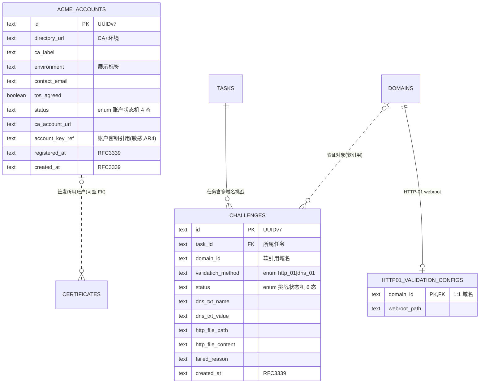

# 数据库设计 · ACME 签发(acme)

> 文档状态: draft(待 orchestrator 统一送审)· 层级: 技术契约(DB)· 端点: app · 撰写: architect
> 依据(approved,唯一设计依据): `modules/acme.md §4 数据来源`(DS1 账户 / DS2 验证执行配置 / DS3 挑战记录)· `flows/acme.md`(账户状态机 4 态 · 验证挑战状态机 6 态,引用不复述)· `TECH.md`(SeaORM 1.x / UUIDv7 / 枚举 §4.3 / 时间 RFC3339 / 敏感数据 AR4 / instant-acme 0.8)。
> 类型口径见 [`certificates.md` 顶部](./certificates.md);全局 ER 见 [`_overview.md`](./_overview.md)。

---

## 1. 实体/表清单

| 表 | 归属 | 职责 |
| --- | --- | --- |
| `acme_accounts` | 本模块 | ACME 账户实体(可多):目标 CA/环境、邮箱、条款同意、账户状态、账户密钥引用 |
| `http01_validation_configs` | 本模块 | HTTP-01 验证**执行配置**(webroot 路径),按域名(DEA5;DNS-01 无常驻参数) |
| `challenges` | 本模块 | 验证挑战记录:每域名每次签发/续签一个,关联 task;挑战状态机 6 态 |

> 关联但不在本模块建表:`domains`(验证对象,challenges 软引用)、`tasks`(挑战归某任务,DS7)、`certificates`(委托上下文,取证交回不留存,DEA4)、settings 默认账户指向(settings 侧)。

---

## 2. 表 `acme_accounts`

一个账户 = 在某 CA 上的一份身份;支持多账户(不同 CA / 生产·测试环境,DA3)。

| 字段 | 类型 | 约束 | 可空 | 默认 | 说明 |
| --- | --- | --- | :-: | --- | --- |
| `id` | `TEXT·UUIDv7` | PK | 否 | 生成 | 账户主键;被 `certificates.acme_account_id` / `settings.default_acme_account_id` 引用 |
| `directory_url` | `TEXT` | NOT NULL | 否 | — | ACME 目录端点 URL——**唯一标定"目标 CA + 环境"**(如 LE 生产/测试为不同 URL);instant-acme 据此建订单 |
| `ca_label` | `TEXT` | — | 是 | NULL | CA 展示名(如 "Let's Encrypt",A2 呈现用) |
| `environment` | `TEXT` | — | 是 | NULL | CA 环境展示标签(生产/测试,A2/DS1)。**说明**:为展示属性、由 `directory_url` 决定;非 §4.3 状态枚举,故存展示标签不设强类型枚举(如后续需强类型化,经 architect 走枚举变更入口纳入 §4.3) |
| `contact_email` | `TEXT` | NOT NULL | 否 | — | 联系邮箱(DS1;MVP 单邮箱) |
| `tos_agreed` | `BOOLEAN` | NOT NULL | 否 | `false` | 服务条款同意情况(DS1;注册前提,AT1) |
| `status` | `TEXT·enum{unconfigured,registering,registered,registration_failed}` | NOT NULL | 否 | `registering` | ACME 账户状态机(flows §2.1)。**注**:`unconfigured` 为"无账户"的概念初始态(无行即此态),**持久化行不取 `unconfigured`**——新建行自 `registering` 起(AT1) |
| `ca_account_url` | `TEXT` | — | 是 | NULL | CA 注册成功后返回的账户资源 URL(account kid);供复用账户签发(AT2 后回填) |
| `account_key_ref` | `TEXT` | — | 是 | NULL | **账户密钥存储位置引用**(DS1,敏感 AR4);密钥材料密文落数据目录,**库内只存引用键**;密钥生成后写入 |
| `registered_at` | `TEXT·RFC3339` | — | 是 | NULL | 注册成功时间(DS1;AT2 时写入) |
| `last_error` | `TEXT` | — | 是 | NULL | 注册失败原因摘要(`registration_failed` 时展示,AT3) |
| `created_at` | `TEXT·RFC3339` | NOT NULL | 否 | now | 创建时间 |
| `updated_at` | `TEXT·RFC3339` | NOT NULL | 否 | now | 最近更新(编辑邮箱/重试/状态推进) |

### 2.1 主键与外键·索引

- **PK**:`id`。无出向 FK。被引用:`certificates.acme_account_id`(SET NULL)、`settings.default_acme_account_id`(SET NULL)。
- 索引:`idx_acme_account_status`(`status`,列表/可用账户筛选);`idx_acme_account_directory`(`directory_url`,同 CA 账户归并)。
- 说明:不设 `(directory_url, contact_email)` 唯一约束——允许同 CA 同邮箱下的多账户配置(DA3 支持多账户,不强收敛)。

### 2.2 账户密钥敏感边界

- `account_key_ref` 只存引用;账户密钥为敏感数据(project §7 / AR4),密文落数据目录(age 加密),**绝不明文入库/入日志**。移除账户(AT5)时按引用清除密钥材料。

---

## 3. 表 `http01_validation_configs`(HTTP-01 执行配置)

HTTP-01 验证的 webroot 路径,按域名持有(DEA5:执行配置归 acme);DNS-01 无常驻参数(挑战时动态生成 TXT,DS2),故本表**仅 HTTP-01**。

| 字段 | 类型 | 约束 | 可空 | 默认 | 说明 |
| --- | --- | --- | :-: | --- | --- |
| `domain_id` | `TEXT·UUIDv7` | PK · FK→`domains.id` ON DELETE CASCADE | 否 | — | 域名(1:1);域名删除时其 webroot 配置随之移除 |
| `webroot_path` | `TEXT` | NOT NULL | 否 | — | 该域名 HTTP-01 验证文件放置根目录(B2 / DS2) |
| `created_at` | `TEXT·RFC3339` | NOT NULL | 否 | now | 创建时间 |
| `updated_at` | `TEXT·RFC3339` | NOT NULL | 否 | now | 最近更新 |

- **PK**:`domain_id`(即 1:0..1,一个域名至多一份 HTTP-01 执行配置)。**FK**:`domain_id`→`domains.id`(CASCADE)。

---

## 4. 表 `challenges`(验证挑战记录)

一个挑战 = "某次签发/续签中对**一个域名**证明控制权"的过程(flows §3);certificates 一次委托可多域名(SAN),acme 每域名一个挑战(§3.4)。

| 字段 | 类型 | 约束 | 可空 | 默认 | 说明 |
| --- | --- | --- | :-: | --- | --- |
| `id` | `TEXT·UUIDv7` | PK | 否 | 生成 | 挑战主键 |
| `task_id` | `TEXT·UUIDv7` | FK→`tasks.id` ON DELETE CASCADE · NOT NULL | 否 | — | 所属签发/续签任务(DS7;挑战执行是任务的一环);任务留痕见 tasks |
| `domain_id` | `TEXT·UUIDv7` | **软引用** `domains.id` · NOT NULL | 否 | — | 验证对象域名。软引用:历史挑战不随域名删除受阻(DECD3 允许无关联域名删除),故不设 RESTRICT FK;域名可能已删 |
| `validation_method` | `TEXT·enum{http_01,dns_01}` | NOT NULL | 否 | — | 本次挑战验证方式(§4.3 验证方式类别;取自 domains 关联/向导) |
| `status` | `TEXT·enum{pending,awaiting_manual,validating,passed,failed,cancelled}` | NOT NULL | 否 | `pending` | 验证挑战状态机(flows §3.1,6 态);`awaiting_manual` 仅 DNS-01(CT3),dashboard 待处理源 |
| `dns_txt_name` | `TEXT` | — | 是 | NULL | DNS-01 待添加 TXT 记录名(如 `_acme-challenge.<域名>`,DS3);展示供复制 |
| `dns_txt_value` | `TEXT` | — | 是 | NULL | DNS-01 待添加 TXT 记录值(DS3);非密钥、可入库/展示 |
| `http_file_path` | `TEXT` | — | 是 | NULL | HTTP-01 验证文件路径(`/.well-known/acme-challenge/<token>`,DS3) |
| `http_file_content` | `TEXT` | — | 是 | NULL | HTTP-01 验证文件内容(key authorization,DS3);非私钥、可入库 |
| `authorization_url` | `TEXT` | — | 是 | NULL | ACME 授权/挑战资源引用(instant-acme 校验/重试用) |
| `failed_reason` | `TEXT` | — | 是 | NULL | 失败原因概要(CT6/CT8,DS3;完整日志归 tasks) |
| `created_at` | `TEXT·RFC3339` | NOT NULL | 否 | now | 挑战建立时间(CT1) |
| `updated_at` | `TEXT·RFC3339` | NOT NULL | 否 | now | 最近状态推进时间 |

### 4.1 主键与外键·索引

- **PK**:`id`。**FK**:`task_id`→`tasks.id`(CASCADE)。`domain_id` 为**软引用**(逻辑外键,不设 DB 级联)。
- 索引:`idx_challenge_task`(`task_id`,任务详情取各域名挑战);`idx_challenge_status`(`status`,dashboard 取 `awaiting_manual` 待处理);`idx_challenge_domain`(`domain_id`,按域名查挑战历史)。
- 说明:挑战所用 ACME 账户不设冗余列——经 `task_id`→`certificates.acme_account_id` 可得(单一真相)。

### 4.2 挑战数据敏感性

- TXT 值 / HTTP 文件内容 / key authorization **非私钥、非账户密钥**,不属 AR4 敏感三类,可入库并展示(DNS-01 需展示 TXT 供用户复制)。真正敏感的账户密钥在 `acme_accounts.account_key_ref`。

---

## 5. Mermaid ER 图(本模块 + 邻接)

---

## 6. 纪律

- **账户密钥只存 `account_key_ref`**(AR4):`acme_accounts` 无明文密钥列;密文落数据目录、脱敏不入日志(L6)。
- **acme 不留存证书本体**(DEA4):取证后交回 certificates,本模块无证书文件/私钥列。
- **枚举照 §4.3**:账户状态、挑战状态、验证方式类别取值不自造。`environment` 为展示标签(非 §4.3 枚举),已在 §2 标注治理路径。
- **默认账户不在此存**:仅 settings 存"默认指向"(DS6 / settings DS4),acme 只提供候选、消费不定义。
- DB 只落当前状态列;账户/挑战状态机流转(AT1–AT5 / CT1–CT10)由 core 服务层强制,引用 flows 不复述。
