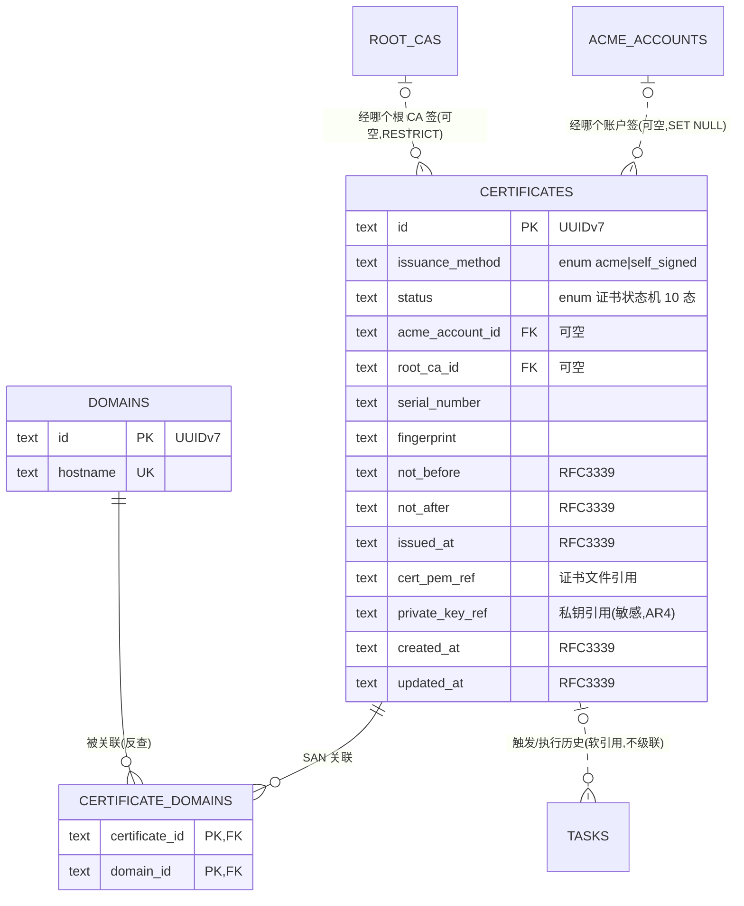

# 数据库设计 · 证书管理(certificates)

> 文档状态: draft(待 orchestrator 统一送审)· 层级: 技术契约(DB)· 端点: app · 撰写: architect
> 依据(approved,唯一设计依据): `modules/certificates.md §4 数据来源` · `flows/certificates.md`(证书状态机 10 态,引用不复述)· `TECH.md`(SeaORM 1.x / UUIDv7 文本 ID / 枚举 §4.3 / 时间 RFC3339 UTC / 敏感数据 AR4)· `ARCHITECTURE.md`(数据模型落 `crates/core/src/persistence/`)。
> **certificates 是全局枢纽**:证书↔域名(SAN 多对多)、证书↔任务(一对多)、证书↔ACME 账户、证书↔根 CA 四类关系在此定义;跨模块全局 ER 与基数见 [`_overview.md`](./_overview.md)。

## 类型口径(SeaORM 1.x → SQLite,全 DB 文档统一)

- `TEXT·UUIDv7`:UUIDv7 文本主键(决策10,时间可排序、对外不透明、不复用)。
- `TEXT·enum{…}`:core `crates/core/src/domain/enums.rs` 单一定义,serde `rename_all="snake_case"`,wire 值严格照 **TECH §4.3**;SeaORM `DeriveActiveEnum`(`rs_type="String"`,`db_type="Text"`)。
- `TEXT·RFC3339`:`time::OffsetDateTime`(SeaORM `TimeDateTimeWithTimeZone`),UTC,wire 为 RFC3339 字符串(TECH §3.5)。
- `BOOLEAN`:SQLite 存 INTEGER 0/1。
- `*_ref`:**存储位置引用**——敏感材料(私钥)密文落 settings 数据存储路径下,库内**只存引用键、绝不存明文**(AR4 / project §7);证书文件(公开)亦以文件引用落数据目录。
- 审计列 `created_at`/`updated_at`(`TEXT·RFC3339`)为 architect 统一约定(全表);**无软删除列**——证书为硬删除(退出状态机,flows §2.4)。

---

## 1. 实体/表清单

| 表 | 归属 | 职责 |
| --- | --- | --- |
| `certificates` | 本模块 | 证书核心实体:状态、签发方式、有效期、标识、文件/私钥存储引用、签发来源(账户/根 CA)引用 |
| `certificate_domains` | 本模块 | 证书 ↔ 域名 的 **SAN 关联表**(多对多);关联链归证书侧(domains 反查) |

> 关联但不在本模块建表:域名 `domains`(domains 模块)、ACME 账户 `acme_accounts`(acme)、根 CA `root_cas`(local-ca)、任务 `tasks`(tasks,软引用本表)。

---

## 2. 表 `certificates`

一张证书 = "某组域名当前的证书";续签刷新同一行(不新建实体,DC1)。

| 字段 | 类型 | 约束 | 可空 | 默认 | 说明 |
| --- | --- | --- | :-: | --- | --- |
| `id` | `TEXT·UUIDv7` | PK | 否 | 生成 | 证书主键;对外稳定、不复用(删除后 tasks 仍持只读引用,TECH §3.5) |
| `issuance_method` | `TEXT·enum{acme,self_signed}` | NOT NULL | 否 | — | 签发方式(DS3 / TECH §4.3 签发方式);`acme`=公共 CA,`self_signed`=自签根 CA |
| `status` | `TEXT·enum{pending_issue,issuing,issue_failed,valid,expiring_soon,renewing,renewal_failed,expired,revoking,revoked}` | NOT NULL | 否 | `pending_issue` | 证书状态机当前态(flows §2.1,10 态);流转由 core 服务层强制,DB 只落当前态 |
| `acme_account_id` | `TEXT·UUIDv7` | FK→`acme_accounts.id` ON DELETE SET NULL | 是 | NULL | 经哪个 ACME 账户签(DS3);仅 `acme` 方式有值;账户被移除则置空(证书后续续签需改选账户,acme A5/AT5) |
| `root_ca_id` | `TEXT·UUIDv7` | FK→`root_cas.id` ON DELETE RESTRICT | 是 | NULL | 经哪个根 CA 签(DS3);仅 `self_signed` 方式有值;MVP 根 CA 不可移除(local-ca LC5),故 RESTRICT |
| `serial_number` | `TEXT` | — | 是 | NULL | 证书序列号(标识,DS1);签发成功后写入,续签刷新(DC1);未签发前为空 |
| `fingerprint` | `TEXT` | — | 是 | NULL | 证书指纹(如 SHA-256,标识,DS1);签发成功后写入,续签刷新 |
| `not_before` | `TEXT·RFC3339` | — | 是 | NULL | 有效期生效时间(DS1);未签发前为空 |
| `not_after` | `TEXT·RFC3339` | — | 是 | NULL | 有效期失效时间(DS1);扫描器据此判定 `valid→expiring_soon`(T6)/`→expired`(T10) |
| `issued_at` | `TEXT·RFC3339` | — | 是 | NULL | 最近一次成功签发/续签落地时间(DS1 签发时间;续签刷新,DC1) |
| `cert_pem_ref` | `TEXT` | — | 是 | NULL | 叶子证书 + 证书链的存储位置引用(DS1/DS6);公开材料,落数据目录文件;未签发前为空 |
| `private_key_ref` | `TEXT` | — | 是 | NULL | **私钥存储位置引用**(DS6,敏感 AR4);密钥材料密文落数据目录,**库内只存引用键**;导出时按引用读取 |
| `last_error` | `TEXT` | — | 是 | NULL | 最近一次失败原因摘要(冗余自最近失败任务,便于列表/详情直显;完整日志归 tasks) |
| `created_at` | `TEXT·RFC3339` | NOT NULL | 否 | now | 条目创建时间(T1 创建条目) |
| `updated_at` | `TEXT·RFC3339` | NOT NULL | 否 | now | 最近状态/字段更新时间 |

### 2.1 主键与外键

- **PK**:`id`。
- **FK**:`acme_account_id`→`acme_accounts.id`(SET NULL,可空);`root_ca_id`→`root_cas.id`(RESTRICT,可空)。
- **被引用**:`certificate_domains.certificate_id`(CASCADE)、`tasks.certificate_id`(**软引用**,不级联)、`internal_cert_revocations.certificate_id`(软引用)。

### 2.2 索引

| 索引 | 列 | 用途 |
| --- | --- | --- |
| `idx_cert_status` | `status` | dashboard 三指标/待处理清单、列表按状态筛选(A1) |
| `idx_cert_issuance_method` | `issuance_method` | 列表按签发方式筛选(A1) |
| `idx_cert_not_after` | `not_after` | 扫描器按到期时间扫描(T6/T10 判定) |
| `idx_cert_acme_account` | `acme_account_id` | "该账户签了哪些证书"(acme A5 移除影响提示) |
| `idx_cert_root_ca` | `root_ca_id` | "该根 CA 签了哪些内网证书"(local-ca A1 概览) |

### 2.3 业务不变量(服务层强制,非 DB 约束)

- **签发来源互斥**:`acme` 方式 ⇒ `acme_account_id` 有值、`root_ca_id` 为空;`self_signed` 方式 ⇒ 反之(SQLite 不设跨列 CHECK,由 core 服务层保证)。
- 状态机合法流转、"进行中态不可删除"等规则由 core 服务层强制(flows §2.3/§2.4),DB 不复述。

---

## 3. 表 `certificate_domains`(SAN 关联)

证书 ↔ 域名 多对多(一证多域 SAN;一域可被多证关联,DEC4 / domains DS4)。

| 字段 | 类型 | 约束 | 可空 | 默认 | 说明 |
| --- | --- | --- | :-: | --- | --- |
| `certificate_id` | `TEXT·UUIDv7` | PK(复合)· FK→`certificates.id` ON DELETE CASCADE | 否 | — | 证书侧;证书删除时其 SAN 关联随之移除 |
| `domain_id` | `TEXT·UUIDv7` | PK(复合)· FK→`domains.id` ON DELETE RESTRICT | 否 | — | 域名侧;域名被任一证书关联即不可删(RESTRICT 兜底 domains DECD3 应用层硬拦截) |

### 3.1 主键与外键

- **复合 PK**:`(certificate_id, domain_id)`——天然保证"同一域名在同一证书内至多出现一次"。
- **FK**:`certificate_id`→`certificates.id`(CASCADE);`domain_id`→`domains.id`(RESTRICT)。

### 3.2 索引

| 索引 | 列 | 用途 |
| --- | --- | --- |
| (PK) | `(certificate_id, domain_id)` | 正向:某证书的 SAN 域名清单 |
| `idx_certdom_domain` | `domain_id` | 反向:某域名被哪些证书覆盖(domains 证书态投影 DS3/DS4、删除前置校验) |

### 3.3 业务不变量(服务层强制)

- **至多一个通配符**(DEC4):同一证书关联的域名中,`domains.is_wildcard=true` 的至多一个;SQLite 无法简洁表达"关联集合内至多一个通配符",由 core 服务层在建立关联时校验。
- **通配符仅 DNS-01**(glossary):通配符域名对应挑战强制 `dns_01`(acme CT3);校验在签发流程。

---

## 4. Mermaid ER 图(本模块 + 邻接)

> `..`(非识别关系)= 可空/软引用:`certificates.acme_account_id`、`certificates.root_ca_id` 为可空 FK;`tasks.certificate_id` 为软引用(证书硬删除后任务历史只读保留,tasks Q2/DEC3)。

---

## 5. 敏感数据与状态机纪律

- **私钥只存 `private_key_ref`**(AR4):`certificates` 无任何明文密钥列;私钥密文由 `crates/core/src/secrets/`(age 加密)落数据目录,库内仅引用键。证书文件(公开)以 `cert_pem_ref` 落数据目录。
- **枚举照 TECH §4.3**:`status`、`issuance_method` 取值不自造;新增/改值须经 architect 改 `enums.rs` + 同步 §4.3 + 重新导出 TS。
- **DB 只落当前状态列**:证书状态机流转(T1–T24)、取消回退等规则由 core 服务层强制,本文件引用 `flows/certificates.md` 不复述。
