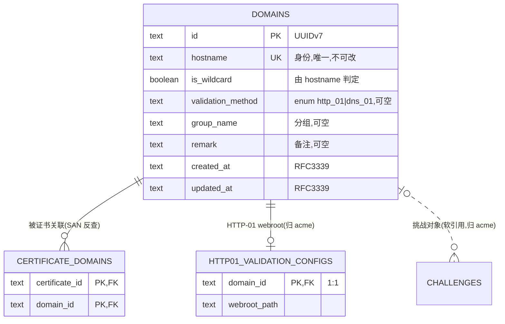

# 数据库设计 · 域名管理(domains)

> 文档状态: draft(待 orchestrator 统一送审)· 层级: 技术契约(DB)· 端点: app · 撰写: architect
> 依据(approved,唯一设计依据): `modules/domains.md §4 数据来源` · `flows/domains.md`(域名无独立状态机,DECD1)· `TECH.md`(SeaORM 1.x / UUIDv7 / 枚举 §4.3 / 时间 RFC3339)。
> 类型口径见 [`certificates.md` 顶部](./certificates.md);全局 ER 见 [`_overview.md`](./_overview.md)。域名 ↔ 证书的 SAN 关联表 `certificate_domains` 归 certificates(反查在此说明,不在本模块建表)。

---

## 1. 实体/表清单

| 表 | 归属 | 职责 |
| --- | --- | --- |
| `domains` | 本模块 | 域名核心实体:hostname(身份)、通配符标识、分组、备注、**域名↔验证方式类别关联** |

> 关联但不在本模块建表:`certificate_domains`(证书 SAN,归 certificates;domains 反查证书态投影 DS3/DS4)、`http01_validation_configs`(HTTP-01 webroot 执行配置,归 acme,DEA5)。域名**无独立生命周期状态机**(DECD1),故无状态列。

---

## 2. 表 `domains`

| 字段 | 类型 | 约束 | 可空 | 默认 | 说明 |
| --- | --- | --- | :-: | --- | --- |
| `id` | `TEXT·UUIDv7` | PK | 否 | 生成 | 域名主键 |
| `hostname` | `TEXT` | **UNIQUE** · NOT NULL | 否 | — | 主机名(身份,如 `example.com` / `*.example.com`);**同实例唯一**(DS1 / B1);**不可编辑**(改名=删+增,DECD2) |
| `is_wildcard` | `BOOLEAN` | NOT NULL | 否 | — | 是否通配符(由 `hostname` 的 `*.` 前缀判定并落库,便于筛选;判定归服务层,DS1)|
| `validation_method` | `TEXT·enum{http_01,dns_01}` | — | 是 | NULL | 域名↔验证方式**类别**关联(DS2 / DECM2,验证方式类别 §4.3);未设置为空;通配符须为 `dns_01`(服务层强制)。webroot 等执行配置归 acme(DEA5) |
| `group_name` | `TEXT` | — | 是 | NULL | 分组(组织/筛选标签;每域名至多一个分组,DECM1) |
| `remark` | `TEXT` | — | 是 | NULL | 备注(DS1) |
| `created_at` | `TEXT·RFC3339` | NOT NULL | 否 | now | 创建时间 |
| `updated_at` | `TEXT·RFC3339` | NOT NULL | 否 | now | 最近编辑时间(分组/备注/验证方式关联) |

### 2.1 主键与外键

- **PK**:`id`。
- **唯一键**:`hostname`(同实例不重复,B1)。
- 本表**无出向 FK**。被引用:`certificate_domains.domain_id`(RESTRICT)、`http01_validation_configs.domain_id`(CASCADE,acme)、`challenges.domain_id`(软引用,acme)。

### 2.2 索引

| 索引 | 列 | 用途 |
| --- | --- | --- |
| `uq_domain_hostname` | `hostname` (UNIQUE) | 身份唯一约束 + 按 hostname 关键字/精确查(A1/A2) |
| `idx_domain_group` | `group_name` | 列表按分组筛选(A1) |

### 2.3 业务不变量(服务层强制)

- **通配符 ⇒ `validation_method = dns_01`**(glossary / C2 / DECM2):`is_wildcard=true` 时验证方式类别只能 `dns_01`;服务层在设置关联时校验。
- **删除硬拦截**(DECD3):域名被任一现存证书关联(`certificate_domains` 存在行)时不可删;由服务层前置校验,`certificate_domains.domain_id` 的 `ON DELETE RESTRICT` 作 DB 兜底。

---

## 3. 证书态投影(只读消费,不建表)

域名列表/详情呈现的证书态(有效/即将到期/失败/无证书)与关联证书清单,均为 **certificates 证书状态机在域名维度的投影**(DS3),经反查关联表得到,domains 不落证书状态、不建副本(DD1 精神):

- **反查路径**:`domains.id` → `certificate_domains.domain_id` → `certificates`(取 `status` / `not_after` 等)。
- **"无证书"**:该域名在 `certificate_domains` 无任何行(本模块可判定,flows §2.1)。
- 列表聚合口径(如取"最紧急"关联证书态)属页面 PRD,DB 层不预置。

---

## 4. Mermaid ER 图(本模块 + 邻接)

> 域名 ↔ 证书为**多对多**(经 `certificate_domains`);域名 ↔ HTTP-01 执行配置为 **1:0..1**(`http01_validation_configs`,归 acme,DEA5)。`validation_method`(类别选择)归 domains、webroot 路径(执行参数)归 acme——边界见 acme DEA5(已裁决)。

---

## 5. 纪律

- **枚举照 §4.3**:`validation_method` 取 `http_01`/`dns_01`,与 acme/domains 共用同一枚举(§4.3 验证方式类别),不自造。
- **无状态机**:域名无生命周期状态列(DECD1);证书态一律投影自 certificates,不落副本。
- 无敏感数据、无软删除(硬删除,受 DECD3 前置校验保护)。
