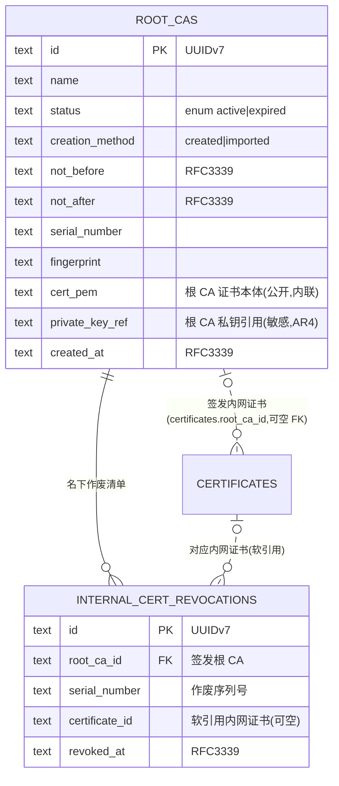

# 数据库设计 · 自签根 CA(local-ca)

> 文档状态: draft(待 orchestrator 统一送审)· 层级: 技术契约(DB)· 端点: app · 撰写: architect
> 依据(approved,唯一设计依据): `modules/local-ca.md §4 数据来源`(DS1 根 CA / DS2 私钥 / DS3 作废记录)· `flows/local-ca.md`(根 CA 状态机 2 态 · 多根并存 LC6 · 不显式移除 LC5)· `TECH.md`(SeaORM 1.x / UUIDv7 / 枚举 §4.3 / 时间 RFC3339 / 敏感数据 AR4 / rcgen 0.14 · 决策5 注:MVP 作废=本地作废记录)。
> 类型口径见 [`certificates.md` 顶部](./certificates.md);全局 ER 见 [`_overview.md`](./_overview.md)。内网证书本体/状态归 certificates(走证书状态机,LC2),本模块不建证书表。

---

## 1. 实体/表清单

| 表 | 归属 | 职责 |
| --- | --- | --- |
| `root_cas` | 本模块 | 根 CA 实体(可多,LC6):名称、状态、有效期、创建方式、证书本体、指纹/序列号、私钥引用 |
| `internal_cert_revocations` | 本模块 | 根 CA 名下**内网证书作废记录**(已作废序列号清单,DS3;rcgen 无 CRL/OCSP,MVP 本地作废记录) |

> "某根 CA 签发了哪些内网证书"(DS3 前半)**无需独立关联表**——由 `certificates.root_ca_id` FK 直接反查(`SELECT … WHERE root_ca_id=?`,单一真相,不冗余建表)。本模块仅额外持有需**独立于证书生命周期长存**的作废清单(见 §3)。

---

## 2. 表 `root_cas`

一个根 CA = 一份用于内网签发的自签根证书;支持多根并存(LC6)。创建/导入为本地同步操作、无过渡态(LC1)。

| 字段 | 类型 | 约束 | 可空 | 默认 | 说明 |
| --- | --- | --- | :-: | --- | --- |
| `id` | `TEXT·UUIDv7` | PK | 否 | 生成 | 根 CA 主键;被 `certificates.root_ca_id` / `internal_cert_revocations.root_ca_id` 引用 |
| `name` | `TEXT` | NOT NULL | 否 | — | 根 CA 名称/标识(DS1/DS5;创建/导入录入) |
| `status` | `TEXT·enum{active,expired}` | NOT NULL | 否 | `active` | 根 CA 状态机(flows §2.1,2 态);扫描判定 `active→expired`(L3);`expired` 拒绝新签发委托(§3.4) |
| `creation_method` | `TEXT` | NOT NULL | 否 | — | 创建方式:`created`(新建)/`imported`(导入),DS1。**说明**:局部 2 值属性,非 §4.3 跨端状态枚举;沿 wire snake_case,如需前端强类型消费再经 architect 纳入 §4.3 |
| `not_before` | `TEXT·RFC3339` | NOT NULL | 否 | — | 有效期生效时间(DS1) |
| `not_after` | `TEXT·RFC3339` | NOT NULL | 否 | — | 有效期失效时间(DS1);扫描器据此判定 `expired`(L3) |
| `serial_number` | `TEXT` | — | 是 | NULL | 根 CA 证书序列号(标识,DS1/A1) |
| `fingerprint` | `TEXT` | — | 是 | NULL | 根 CA 证书指纹(标识,DS1/A1) |
| `cert_pem` | `TEXT` | NOT NULL | 否 | — | 根 CA 证书本体 PEM(DS1;**公开**材料,非敏感,内联存储);导出(A4)与签发组链直接取用 |
| `private_key_ref` | `TEXT` | NOT NULL | 否 | — | **根 CA 私钥存储位置引用**(DS2,敏感 AR4;敏感级高于叶子私钥,§4 敏感边界);密文落数据目录,**库内只存引用键** |
| `created_at` | `TEXT·RFC3339` | NOT NULL | 否 | now | 创建/导入时间(DS1) |
| `updated_at` | `TEXT·RFC3339` | NOT NULL | 否 | now | 最近更新(状态推进等) |

### 2.1 主键与外键·索引

- **PK**:`id`。无出向 FK。被引用:`certificates.root_ca_id`(RESTRICT)、`internal_cert_revocations.root_ca_id`(RESTRICT)。
- 索引:`idx_rootca_status`(`status`,列表/有效根筛选);`idx_rootca_not_after`(`not_after`,扫描判定到期 L3)。
- **无删除路径**(LC5:MVP 不提供显式移除根 CA),故 RESTRICT 兼容且实际不触发级联。

### 2.2 根 CA 私钥敏感边界

- `private_key_ref` 只存引用;根 CA 私钥泄露则其签出全部内网证书可被冒用,敏感级别最高(DS2 注),密文落数据目录、脱敏不入日志。`cert_pem`(公开)内联;私钥**绝不**内联/明文入库(AR4)。

---

## 3. 表 `internal_cert_revocations`(内网证书作废记录)

根 CA 名下"已作废内网证书序列号清单"(DS3)。rcgen 不产 CRL/OCSP,MVP 作废=本地作废记录(TECH 决策5 注);**须独立于内网证书实体长存**——已吊销内网证书可被删除(证书状态机:已吊销→删除),但其作废事实应留在根 CA 名下,故本表以**序列号**为账本、软引用证书 id。

| 字段 | 类型 | 约束 | 可空 | 默认 | 说明 |
| --- | --- | --- | :-: | --- | --- |
| `id` | `TEXT·UUIDv7` | PK | 否 | 生成 | 作废记录主键 |
| `root_ca_id` | `TEXT·UUIDv7` | FK→`root_cas.id` ON DELETE RESTRICT · NOT NULL | 否 | — | 签发该内网证书的根 CA(B2 由其记录作废,§3.5) |
| `serial_number` | `TEXT` | NOT NULL | 否 | — | 被作废内网证书序列号(作废清单键,CRL 式) |
| `certificate_id` | `TEXT·UUIDv7` | **软引用** `certificates.id` | 是 | NULL | 对应内网证书(可能已删除);软引用,不随证书删除受阻 |
| `revoked_at` | `TEXT·RFC3339` | NOT NULL | 否 | — | 作废标记时间(吊销成功 T18 时写入) |
| `created_at` | `TEXT·RFC3339` | NOT NULL | 否 | now | 记录创建时间 |

### 3.1 主键与外键·索引

- **PK**:`id`。**FK**:`root_ca_id`→`root_cas.id`(RESTRICT)。`certificate_id` 为软引用(逻辑外键)。
- **唯一约束**:`(root_ca_id, serial_number)`——同一根 CA 下同一序列号至多一条作废记录(幂等)。
- 索引:`idx_revoke_rootca`(`root_ca_id`,取某根 CA 作废清单);`idx_revoke_cert`(`certificate_id`,反查)。

---

## 4. Mermaid ER 图(本模块 + 邻接)

> "某根 CA 签了哪些内网证书" = `certificates WHERE root_ca_id=?`(不建冗余关联表);"其中哪些作废" 兼看证书 `status=revoked` 与本表——本表额外承载"证书已删除后仍需留存的作废序列号"。

---

## 5. 纪律

- **根 CA 私钥只存 `private_key_ref`**(AR4);`cert_pem`(公开)内联可存;不做含私钥导出(LC4)。
- **不复述证书状态**(LC2):内网证书状态/续签/到期/吊销走证书状态机,本模块只提供签发结果与作废标记,不建内网证书表。
- **枚举照 §4.3**:根 CA 状态 `active`/`expired` 不自造;`creation_method` 为局部属性,已在 §2 标注治理路径。
- 根 CA 无"进行中/即将到期"态(LC1/LC3);DB 仅两态,扫描驱动 `active→expired`(引用 flows,不复述)。
