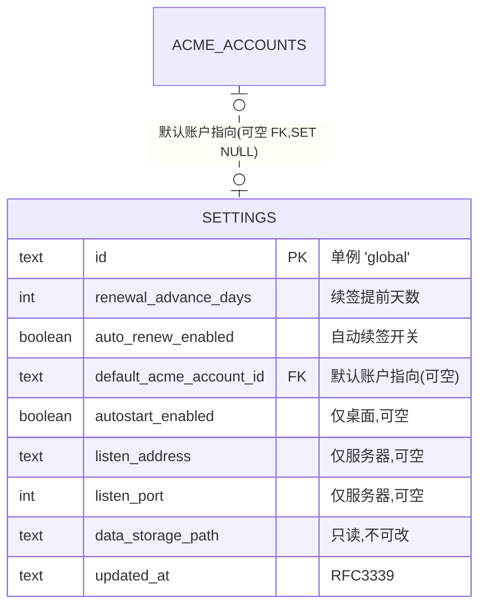

# 数据库设计 · 系统设置(settings)

> 文档状态: draft(待 orchestrator 统一送审)· 层级: 技术契约(DB)· 端点: app · 撰写: architect
> 依据(approved,唯一设计依据): `modules/settings.md §4 数据来源`(DS1–DS5)· `flows/settings.md`(无实体状态机 SF1 · 存储路径只读 SF5/DEC3 · 无重试参数 SF2)· `TECH.md`(SeaORM 1.x / 时间 RFC3339 / 运行形态枚举 §4.3)。
> 类型口径见 [`certificates.md` 顶部](./certificates.md);全局 ER 见 [`_overview.md`](./_overview.md)。

---

## 1. 实体/表清单

| 表 | 归属 | 职责 |
| --- | --- | --- |
| `settings` | 本模块 | 全局配置**单例**:运行形态配置 + 数据存储路径(只读)+ 续签策略 + 默认 ACME 账户指向 |

> settings 无实体生命周期状态机(SF1),是"一次设定、长期生效"的全局旋钮集合;采**单例单行**(非 key-value)以保类型安全与约束(如默认账户 FK)。运行形态四类配置项少、同页呈现(DEC1),单行承载最简。

---

## 2. 表 `settings`(单例)

全局唯一一行;主键为固定常量,应用层保证仅一行(见 §2.2)。

| 字段 | 类型 | 约束 | 可空 | 默认 | 说明 |
| --- | --- | --- | :-: | --- | --- |
| `id` | `TEXT` | PK · CHECK(`id='global'`) | 否 | `'global'` | 单例哨兵主键;仅一行(§2.2) |
| `renewal_advance_days` | `INTEGER` | NOT NULL | 否 | `30`(architect 默认) | 续签提前天数(DS3/C1);certificates 据此判定"即将到期"(T6),消费不定义状态 |
| `auto_renew_enabled` | `BOOLEAN` | NOT NULL | 否 | `true` | 自动续签开关(DS3/C2);开启则"即将到期"自动续签 + 续签失败未过期者随周期扫描再尝试(SF2,无独立重试参数) |
| `default_acme_account_id` | `TEXT·UUIDv7` | FK→`acme_accounts.id` ON DELETE SET NULL | 是 | NULL | 默认 ACME 账户**指向**(DS4/D1);仅存引用,账户本体归 acme;账户被删则置空,签发处引导显式选择(settings D1) |
| `autostart_enabled` | `BOOLEAN` | — | 是 | NULL | **仅桌面**:开机自启开关(DS1/A2);服务器形态无意义,留空 |
| `listen_address` | `TEXT` | — | 是 | NULL | **仅服务器**:守护进程 Web UI 监听地址(DS1/A3);默认仅本机/可信内网,设为对外可达须界面提示公网暴露风险(roles §3) |
| `listen_port` | `INTEGER` | — | 是 | NULL | **仅服务器**:Web UI 监听端口(DS1/A3);有合理默认 |
| `data_storage_path` | `TEXT` | NOT NULL | 否 | 部署时定 | 数据存储根路径(DS2/B1);其下含私钥/账户密钥等敏感材料;**运行期只读、不可改、无迁移语义**(SF5/DEC3),库内仅记录既定路径供展示 |
| `updated_at` | `TEXT·RFC3339` | NOT NULL | 否 | now | 最近保存时间 |

### 2.1 主键与外键

- **PK**:`id`(固定 `'global'`)。**FK**:`default_acme_account_id`→`acme_accounts.id`(SET NULL,可空)。

### 2.2 单例约束

- 通过 `CHECK(id='global')` + 应用层"读取即 upsert 该行"保证**仅一行**;无需索引(单行)。
- 备选(等价):`id INTEGER PK CHECK(id=1)`。architect 取固定文本哨兵 `'global'`,语义直观。

### 2.3 未持久化项(消费/运行时,不建列)

| 项 | 为何不建列 |
| --- | --- |
| 当前运行形态(`desktop`/`server`,§4.3 运行形态枚举) | 运行载体既定事实、运行时探测(DS5/SF4),**非本模块存储的可变配置**;前端经 API 取形态标志做显隐(TECH §3.6),DB 不落 |
| 续签重试次数/间隔 | SF2:不设独立重试参数(自动再尝试依附扫描) |
| 扫描/检测周期 | SF3:实现机制,不设用户旋钮 |
| 账户/登录/权限 | DEC2:MVP 无鉴权(project §9-D4) |

---

## 3. Mermaid ER 图(本模块 + 邻接)

> 形态相关字段(`autostart_enabled` vs `listen_address`/`listen_port`)按当前运行形态取其一使用,另一组留空;前端依运行形态标志显隐(settings 形态差异表)。

---

## 4. 纪律

- **默认账户仅存指向**(DEC4):不复制账户明细(邮箱/CA/密钥),只存 `default_acme_account_id` FK;账户本体唯一在 acme。
- **存储路径只读**(SF5/DEC3):`data_storage_path` 运行期不可改、无迁移;库内记录展示,应用层不提供运行期改写。
- **运行形态不持久**(SF4/DS5):不建形态列,运行时探测。
- 无敏感明文列(数据存储路径本身非密钥;私钥/账户密钥落该路径下但由各模块 `*_ref` 引用,不在 settings)。
