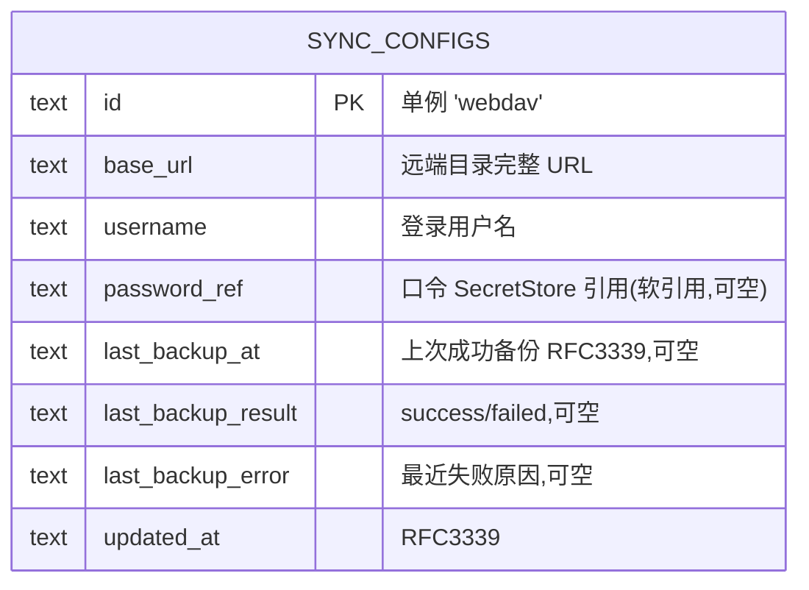

# 数据库设计 · 备份同步(sync / WebDAV)

> 文档状态: draft(待 orchestrator 统一送审)· 层级: 技术契约(DB)· 端点: app · 撰写: architect
> 依据(approved,唯一设计依据): `modules/sync.md §4 数据来源`(DS1 连接配置单份 / DS3 口令不持久)· §5 决策记录(口令分流 DEC4 · 覆盖式恢复 DEC5)· `TECH.md`(SeaORM 1.x / 时间 RFC3339 / SecretStore 引用口径)。
> 类型口径见 [`certificates.md` 顶部](./certificates.md);全局 ER 见 [`_overview.md`](./_overview.md)。

---

## 1. 实体/表清单

| 表 | 归属 | 职责 |
| --- | --- | --- |
| `sync_configs` | 本模块 | WebDAV 连接配置**单例**:服务器 + 远程目录(归一 `base_url`)+ 用户名 + 口令**引用** + 上次备份留痕 |

> 全应用至多一条 WebDAV 配置(PRD DS1「全局单份」),采**单例单行**(同 settings 单例口径):类型安全、无需列表 / 分页。备份快照内容(各业务表 + 密钥材料)不在本表 —— 它们是打包对象,归各业务模块;本表只存「连到哪、上次备得怎样」。

---

## 2. 表 `sync_configs`(单例)

全局唯一一行;主键为固定哨兵 `'webdav'`,应用层 upsert 保证仅一行(§2.2)。迁移:`m20260719_000002`。

| 字段 | 类型 | 约束 | 可空 | 默认 | 说明 |
| --- | --- | --- | :-: | --- | --- |
| `id` | `TEXT` | PK(auto_increment=false) | 否 | `'webdav'` | 单例哨兵主键;仅一行(§2.2) |
| `base_url` | `TEXT` | NOT NULL | 否 | — | 远端目录**完整 URL**(server_url + remote_dir 拼好、归一末尾斜杠;DS1)。实际请求目标;server_url / remote_dir 拆分由服务层展示时回推,不冗余建列 |
| `username` | `TEXT` | NOT NULL | 否 | — | WebDAV 登录用户名(DS1) |
| `password_ref` | `TEXT` | — | 是 | NULL | WebDAV 口令的 **SecretStore 引用键**(密文落 `secrets/*.age`;口令本体绝不入库,DEC4 / project §7)。NULL = 未存口令 |
| `last_backup_at` | `TEXT·RFC3339` | — | 是 | NULL | 最近一次**成功**备份时刻(B3 留痕;NULL = 从未成功) |
| `last_backup_result` | `TEXT` | — | 是 | NULL | 最近一次备份动作结果:`success` / `failed`(展示用;NULL = 从未备份) |
| `last_backup_error` | `TEXT` | — | 是 | NULL | 最近失败原因(成功时清空) |
| `updated_at` | `TEXT·RFC3339` | NOT NULL | 否 | now | 最近保存时间 |

### 2.1 主键与外键

- **PK**:`id`(固定 `'webdav'`)。**无 FK、无索引**(单行)。
- `password_ref` 为**软引用**(SecretStore 文件键,非库内 FK):口令密文生命周期由应用层管理 —— PUT 重写时删旧密文、DELETE 配置时删密文、boot 孤儿清扫把 `sync_configs.password_ref` 计入存活引用集(不得当孤儿删)。

### 2.2 单例约束

- 应用层「读取即 upsert 该行」保证仅一行;哨兵主键使重复插入自然冲突(同 settings §2.2 口径,文本哨兵语义直观)。
- `GET /sync/webdav-config` 在行不存在时返回 `configured: false`(API 契约 §2.1),不隐式建行;**首次 PUT 才建行**。

### 2.3 未持久化项(消费/运行时,不建列)

| 项 | 为何不建列 |
| --- | --- |
| 备份口令(`passphrase`) | DEC4 / DS3:当次输入、绝不落盘 / 入库 / 入日志;备份包加密强度全系于它不托管 |
| 远端备份清单 | DS4:WebDAV 服务端实时返回(PROPFIND),本端不缓存,不落库 |
| server_url / remote_dir 拆分列 | 拼接口径已归一进 `base_url`;展示拆分由服务层回推(API `SyncConfigView.serverUrl/remoteDir`),冗余建列只会引入不一致面 |
| 恢复进度 / 恢复历史 | 恢复为请求-响应内同步动作(DEC5),无异步状态要追;结果即 `RestoreOutcome` 响应 |

---

## 3. Mermaid ER 图(本模块 + 邻接)

> `password_ref` 指向库外 SecretStore 密文(`secrets/*.age`),图中以「软引用」标注,不连库内实体 —— 与 certificates `cert_pem_ref` / acme_accounts `account_key_ref` / root_cas `private_key_ref` 同一口径(_overview §敏感数据落法)。

---

## 4. 纪律

- **口令绝不入库**(DEC4 / project §7):只存 `password_ref` 引用;密文由 SecretStore(age X25519)管理;读取永不回传本体(API `passwordSet` 布尔表达)。
- **备份口令零持久**(DEC4 / DS3):`passphrase` 不过库、不过盘、不过日志;备份 / 恢复当次内存使用即弃。
- **软引用生命周期归应用层**:`password_ref` 指向的密文在 PUT 重写 / DELETE 配置时同步删除;**boot 孤儿密钥清扫必须把本表 `password_ref` 计入存活引用集**(2026-07-19 修复:漏算导致每次启动误删 WebDAV 口令密文)。
- **留痕只记结果不记内容**:`last_backup_*` 三字段只表达「上次备得怎样」;备份内容(快照)不在库内留痕,远端清单以 WebDAV 为准(DS4)。
- **恢复不改本表语义**:覆盖式恢复逐表替换含本表(备份里的配置一并恢复);恢复后悬空 `password_ref` 由对账置空并提示重存(PRD C3),不在库层做特殊豁免。
