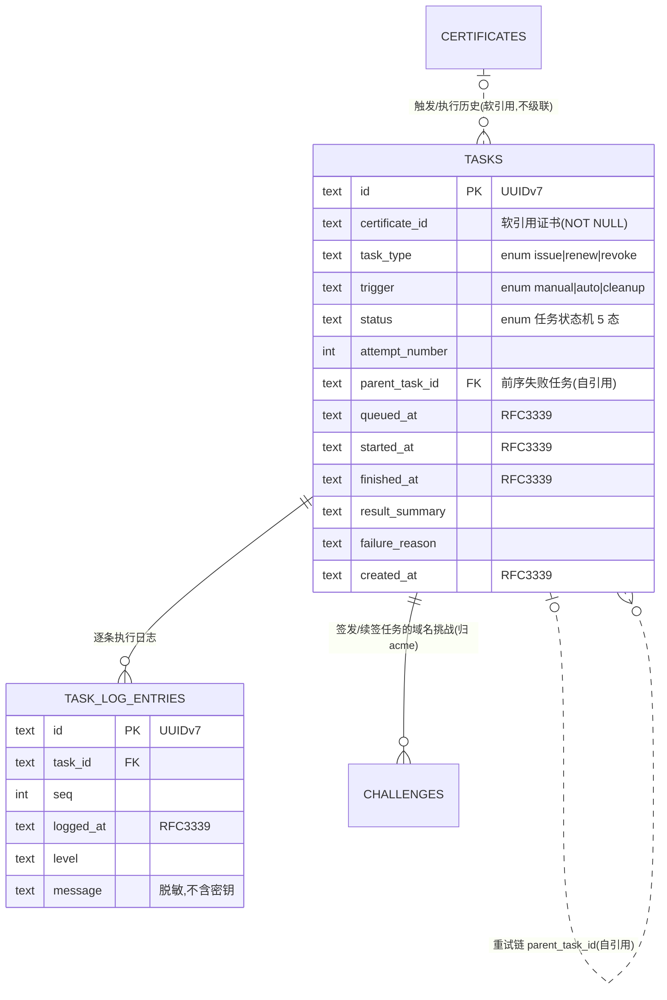

# 数据库设计 · 任务与历史(tasks)

> 文档状态: draft(待 orchestrator 统一送审)· 层级: 技术契约(DB)· 端点: app · 撰写: architect
> 依据(approved,唯一设计依据): `modules/tasks.md §4 数据来源`(DS1 任务 / DS2 日志 / DS3 关联证书 …)· `flows/tasks.md`(任务状态机 5 态 · 类型 · 触发方式 · 重试链 DT1 · 删除保留 DT3/Q2)· `TECH.md`(SeaORM 1.x / UUIDv7 / 枚举 §4.3 / 时间 RFC3339 / 日志脱敏 AR4·L6 / 决策7 自建队列)· `ARCHITECTURE.md §6.1`(任务表即持久队列)。
> 类型口径见 [`certificates.md` 顶部](./certificates.md);全局 ER 见 [`_overview.md`](./_overview.md)。**本模块的 `tasks` 表即持久队列**(`queued` 行=待办队列,AR5),同时是执行历史(只增)。

---

## 1. 实体/表清单

| 表 | 归属 | 职责 |
| --- | --- | --- |
| `tasks` | 本模块 | 任务实体=持久队列+历史:类型、触发方式、关联证书(软引用)、状态、各时间点、结果、失败原因、重试链 |
| `task_log_entries` | 本模块 | 逐条执行日志(验证/CA 交互/错误详情);支持任务进度 SSE 与详情查看;**脱敏不含密钥** |

> 关联但不在本模块建表:`certificates`(软引用,不级联,DT3/Q2)、`challenges`(挑战归 acme,FK 指向本表 `tasks.id`)、settings 存储根路径(DS6)/续签策略(DS5,消费不存)。

---

## 2. 表 `tasks`

一个任务 = 对某张证书的一次执行单元(签发/续签/吊销);证书:任务 = 一:多(DEC4)。

| 字段 | 类型 | 约束 | 可空 | 默认 | 说明 |
| --- | --- | --- | :-: | --- | --- |
| `id` | `TEXT·UUIDv7` | PK | 否 | 生成 | 任务主键;被 `challenges.task_id`、`task_log_entries.task_id`、本表 `parent_task_id` 引用 |
| `certificate_id` | `TEXT·UUIDv7` | **软引用** `certificates.id` · NOT NULL | 否 | — | 关联证书(DS1/DS3)。**软引用**(逻辑外键,不设级联):证书**硬删除后本行保留**、只读留痕;"证书已删除"由 `certificates` 中该 id 是否存在判定(UUIDv7 不复用,不误配)。见 §2.3 |
| `task_type` | `TEXT·enum{issue,renew,revoke}` | NOT NULL | 否 | — | 任务类型(§2.1 / §4.3 任务类型);`renew` 含续签/再获取(已过期/已吊销再获取,DC4) |
| `trigger` | `TEXT·enum{manual,auto,cleanup}` | NOT NULL | 否 | — | 触发方式(§2.2 / §4.3)。`manual`=operator 发起/重试;`auto`=依 settings 自动续签(仅 renew);`cleanup`=证书删除清理时对未完成任务的取消(§5.5,置 `trigger=cleanup`) |
| `status` | `TEXT·enum{queued,running,succeeded,failed,cancelled}` | NOT NULL | 否 | `queued` | 任务状态机(flows §3.1,5 态);`queued`=队列待办;三终态不再变(重试派生新任务,不回炉) |
| `attempt_number` | `INTEGER` | NOT NULL | 否 | `1` | 尝试序号(第几次尝试,DS1;重试链首个为 1,派生递增) |
| `parent_task_id` | `TEXT·UUIDv7` | FK→`tasks.id`(自引用) ON DELETE SET NULL | 是 | NULL | 前序失败任务引用(重试链,DT1);由哪个失败任务重试派生而来;首个任务为空。**后继重试任务**反查(`WHERE parent_task_id=?`),不另设列 |
| `queued_at` | `TEXT·RFC3339` | NOT NULL | 否 | now | 入队时间(TT1) |
| `started_at` | `TEXT·RFC3339` | — | 是 | NULL | 开始执行时间(TT2 `running` 时写入) |
| `finished_at` | `TEXT·RFC3339` | — | 是 | NULL | 结束时间(TT3/4/5/6 达终态时写入) |
| `result_summary` | `TEXT` | — | 是 | NULL | 执行结果摘要(成功/失败/已取消,DS1) |
| `failure_reason` | `TEXT` | — | 是 | NULL | 失败原因摘要(TT4,DS1;完整过程见 `task_log_entries`) |
| `created_at` | `TEXT·RFC3339` | NOT NULL | 否 | now | 创建时间(≈ `queued_at`) |
| `updated_at` | `TEXT·RFC3339` | NOT NULL | 否 | now | 最近状态推进时间 |

### 2.1 主键与外键·索引

- **PK**:`id`。**FK**:`parent_task_id`→`tasks.id`(自引用,SET NULL——留存重试链但不因前序被清空而阻塞)。`certificate_id` 为**软引用**(非 DB 外键)。
- 索引:
  - `idx_task_certificate`(`certificate_id`,某证书的任务历史、删除清理定位、dashboard 最近任务 DS3);
  - `idx_task_status`(`status`,队列取 `queued`、列表按状态筛选);
  - `idx_task_type`(`task_type`,按类型筛选 A1);
  - `idx_task_parent`(`parent_task_id`,重试链遍历);
  - `idx_task_queued_at`(`queued_at`,队列 FIFO 调度、历史时间范围筛选/分页)。

### 2.2 队列语义(AR5 / 决策7)

- **`tasks` 即持久队列**:`status=queued` 行是待办队列,tokio worker 按 `queued_at` 取出转 `running`(TT2);无外部队列中间件。
- **崩溃恢复**(boot 序列,ARCHITECTURE §7):启动时遗留 `running`→校正 `failed`(可重试)、`queued` 重排;实现细节由 architect 定,业务底线"不卡死"。DB 层无需额外列,状态列本身承载队列态。
- **重试=派生新任务**(DT1):失败任务保持 `failed`,新任务 `queued` 且 `parent_task_id` 指向它、`attempt_number+1`;不回炉复用。

### 2.3 证书删除后的只读保留(DT3 / Q2)

- 证书硬删除时:该证书未完成任务(`queued`/`running`)经清理转 `cancelled`(`trigger=cleanup`,§5.5);其**历史任务不级联删除**,`certificate_id` 保留原值。
- **"证书已删除"标注**:读取时以 `LEFT JOIN certificates` 该 id 是否命中判定(未命中=已删除),无需冗余布尔列;UUIDv7 不复用保证不误配。
- 避免对已删证书误触发重试:重试前校验证书仍存在(服务层)。

---

## 3. 表 `task_log_entries`(执行日志)

逐条执行日志(DS2):验证/挑战步骤、CA 交互、错误详情;供任务详情查看与失败排查、任务进度 SSE 推送。

| 字段 | 类型 | 约束 | 可空 | 默认 | 说明 |
| --- | --- | --- | :-: | --- | --- |
| `id` | `TEXT·UUIDv7` | PK | 否 | 生成 | 日志条目主键 |
| `task_id` | `TEXT·UUIDv7` | FK→`tasks.id` ON DELETE CASCADE · NOT NULL | 否 | — | 所属任务;任务留存,日志随之留存 |
| `seq` | `INTEGER` | NOT NULL | 否 | — | 任务内序号(有序回放,与 `logged_at` 配合稳定排序) |
| `logged_at` | `TEXT·RFC3339` | NOT NULL | 否 | — | 该条日志时间 |
| `level` | `TEXT` | NOT NULL | 否 | `info` | 日志级别(info/warn/error 等;与 tracing 对齐) |
| `message` | `TEXT` | NOT NULL | 否 | — | 日志内容。**脱敏**:私钥/账户密钥/根 CA 私钥**绝不写入**(DS2 / AR4 / L6) |

- **PK**:`id`。**FK**:`task_id`→`tasks.id`(CASCADE)。索引:`idx_tasklog_task`(`task_id, seq`,按任务有序取日志)。

---

## 4. Mermaid ER 图(本模块 + 邻接)

---

## 5. 纪律

- **日志脱敏**(AR4/L6):`task_log_entries.message` 不含任何密钥材料;敏感数据只在各自 `*_ref` 引用,不进任务/日志。
- **软引用证书、不级联删除**(DT3/Q2):任务历史只增留痕,证书删除后只读保留 + "已删除"标注。
- **不持策略/重试参数**(DT5):无重试次数/间隔列、无到期扫描——续签策略唯一在 settings、扫描唯一在 certificates;tasks 专注"执行+留痕"。
- **枚举照 §4.3**:任务状态/类型/触发方式取值不自造。
- DB 只落当前状态列;状态机流转(TT1–TT7)与证书联动(§4)由 core 服务层/执行器强制,引用 flows 不复述。
