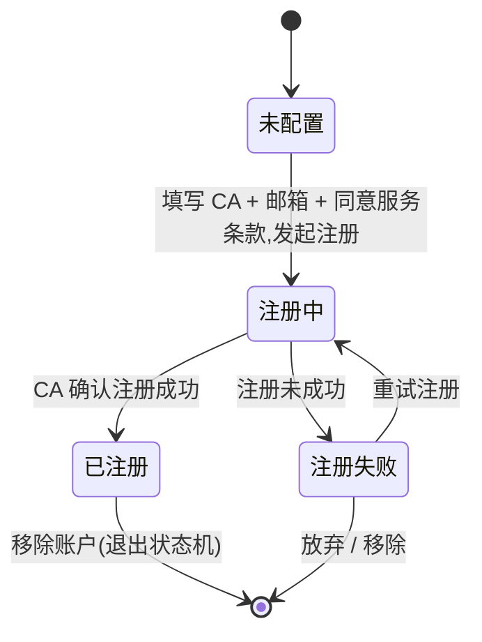
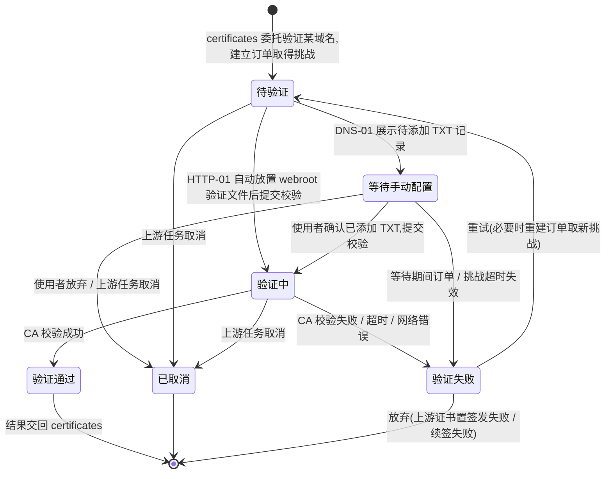

# 业务流程与状态机 · ACME 签发(acme)

> 文档状态: draft · 模块: acme · 端点: app · 撰写: product-manager
> 信任基础: project.md(approved)§5/§6/§7/§9 · roles.md(operator 全权)· glossary.md(术语引用不复述)· flows/certificates.md + modules/certificates.md(证书主线已定:certificates 把"证明域名控制权"委托 acme)
> **单一出现原则**:本文件定义 **ACME 账户状态机** 与 **验证挑战状态机**;certificates / dashboard / tasks 等模块引用挑战状态但**不复述**其定义与流转。**证书状态机**归 flows/certificates.md,本文件引用不复述。

---

## 1. 模块职责与边界

acme 负责"**证明域名控制权**"这一验证环节,以及为此所需的 **ACME 账户**。它不拥有证书本身的生命周期——证书的状态、有效期、存储与到期 / 失败提醒归 certificates(引用不复述)。

### 1.1 本模块负责

- 维护 **ACME 账户**:在某 CA 上建立身份(邮箱 + 同意服务条款),供后续申请 / 续签证书使用(见 §2 账户状态机)。
- 提供 **验证方式向导**:为域名选择并配置 HTTP-01(webroot)或 DNS-01(手动)验证方式。
- **执行验证挑战**:被 certificates 委托时,针对每个待验证域名向 CA 建立订单、取得挑战、完成校验(见 §3 挑战状态机)。
- 完成整段 ACME 订单:全部域名验证通过后**取得证书**,把结果与证书交回 certificates(见 §4.4)。

### 1.2 委托与消费(边界)

| 事项 | 归属模块 | 本模块的关系 |
| --- | --- | --- |
| 证书状态、有效期、签发 / 续签 / 吊销的编排、证书文件存储与到期提醒 | `certificates` | acme 被其**委托**执行域名验证与取证;只接收"验证哪些域名",把验证结果 / 取得的证书**交回**;证书状态机与生命周期归 certificates,不复述 |
| 域名列表、域名与验证方式的**关联** | `domains` | acme 的验证对象是 domains 中已存在的域名;"某域名用哪种验证方式"的关联归 domains;acme 提供向导体验、执行挑战并持有执行参数(webroot 归 acme,已裁决 orchestrator 2026-07-16;见 modules/acme.md DEA5) |
| 签发 / 续签 / 吊销任务的队列、执行时间、日志、重试历史 | `tasks` | 挑战执行是签发 / 续签任务的一环;每次执行的时间 / 结果 / 日志留痕归 tasks;acme 推进挑战状态并把结果反映到任务 |
| 默认 ACME 账户的指定 | `settings` | 签发时若未显式选账户,采用 settings 指定的默认账户;"哪个是默认"的设定归 settings,acme **消费**不定义 |
| 红点 / 待处理高亮(如 DNS-01 等待手动添加 TXT) | `dashboard` | acme **提供**挑战状态数据(尤其"等待手动配置");提醒呈现归 dashboard |
| 自签根 CA 签发内网证书 | `local-ca` | 与 acme 无关;自签方式不经 ACME 验证(certificates 委托 local-ca) |

### 1.3 明确不做(遵 project §6.2)

- ❌ **DNS-01 厂商 API 自动验证**(Cloudflare / 阿里云等):MVP 仅**手动**添加 TXT 记录。
- ❌ 证书的存储 / 到期提醒 / 自动续签调度(归 certificates / settings / tasks)。
- ❌ 证书文件导出、吊销的对外动作(归 certificates;acme 仅在被委托取证 / 验证时与 CA 交互)。

---

## 2. ACME 账户状态机(仅此处定义)

一个 **ACME 账户** 代表在某 CA 上的一份身份。可配置一个或多个账户(不同 CA、或同一 CA 的生产 / 测试环境;见 §5-DA3)。签发走公共 ACME 前,至少需一个 **已注册** 账户。

### 2.1 状态定义

| 中文名 | 英文标识 | 含义(业务口径) | 性质 |
| --- | --- | --- | --- |
| 未配置 | `unconfigured` | 概念初始态:尚未在该 CA 上建立账户(无账户即处于此态) | 初始 · 进行前 |
| 注册中 | `registering` | 已提交账户注册(CA + 邮箱 + 同意服务条款),等待 CA 确认 | 进行中 |
| 已注册 | `registered` | 账户在 CA 上注册成功,可用于签发 / 续签 | 稳态 · 可用 |
| 注册失败 | `registration_failed` | 注册未成功(邮箱无效 / 未同意条款 / 网络错误 / CA 拒绝) | 告警 · 可重试 |

### 2.2 状态流转图

### 2.3 流转规则(权威定义)

| # | 源状态 | 触发事件 / 条件 | 目标状态 | 说明 |
| --- | --- | --- | --- | --- |
| AT1 | (无) | 使用者填写目标 CA、联系邮箱并同意服务条款,发起注册 | 注册中 | 一次可存在多个账户;各账户独立走此机 |
| AT2 | 注册中 | CA 确认注册成功 | 已注册 | 成为可用账户;可被 settings 指定为默认 |
| AT3 | 注册中 | 注册未成功(邮箱无效 / 未同意条款 / 网络 / CA 拒绝) | 注册失败 | 失败原因供界面提示 |
| AT4 | 注册失败 | 使用者重试注册 | 注册中 | 可修正邮箱等后重试 |
| AT5 | 已注册 / 注册失败 | 使用者移除账户 | (退出状态机) | 移除本地账户配置;若有证书正引用该账户签发,需提示影响(见 §4.1 说明) |

> 跨状态动作(不改状态):**查看**账户信息(全部状态,只读)、**编辑联系邮箱**(已注册态更新邮箱,可能触发对 CA 的账户更新,业务上仍视为同一账户)。

---

## 3. 验证挑战状态机(核心 · 仅此处定义)

一个 **验证挑战(Challenge)** = "在某次签发 / 续签中,对**一个域名**证明控制权"的一次过程。certificates 每次委托验证可涉及多个域名(SAN),acme 为每个域名各跑一个挑战(见 §3.4)。

### 3.1 状态定义

| 中文名 | 英文标识 | 含义(业务口径) | 性质 |
| --- | --- | --- | --- |
| 待验证 | `pending` | 验证已发起:acme 已就该域名向 CA 建立订单并取得挑战要求(HTTP-01 的验证文件内容 / DNS-01 的待添加 TXT 记录),尚未开始实际校验 | 初始 · 进行前 |
| 等待手动配置 | `awaiting_manual` | 仅 DNS-01(手动):已向使用者展示待添加的 TXT 记录,等待其在 DNS 处添加并回来确认(HTTP-01 因自动放置 webroot 文件,不经此态) | 进行中 · 等待人工 |
| 验证中 | `validating` | 已请求 CA 校验(HTTP-01:验证文件已就位;DNS-01:使用者已确认添加),等待 CA 访问校验并返回结果 | 进行中 |
| 验证通过 | `passed` | CA 确认域名控制权证明成立;结果交回 certificates 继续取证 | 终态 · 成功 |
| 验证失败 | `failed` | CA 校验未通过 / 超时 / 网络错误 / 文件或 TXT 记录不符 | 告警 · 可重试 |
| 已取消 | `cancelled` | 验证被放弃(使用者取消手动等待 / 上游签发 · 续签任务被取消) | 终态 · 中止 |

### 3.2 状态流转图

### 3.3 流转规则(权威定义)

| # | 源状态 | 触发事件 / 条件 | 目标状态 | 说明 |
| --- | --- | --- | --- | --- |
| CT1 | (无) | certificates 委托对某域名执行验证;acme 用选定 ACME 账户建立订单、取得挑战 | 待验证 | 前提:存在**已注册**账户;域名已在 domains |
| CT2 | 待验证 | 验证方式 = HTTP-01:自动在 webroot 放置验证文件并请求 CA 校验 | 验证中 | HTTP-01 全自动,不经等待手动配置 |
| CT3 | 待验证 | 验证方式 = DNS-01(手动):向使用者展示待添加的 TXT 记录 | 等待手动配置 | 通配符域名只能走此路(glossary) |
| CT4 | 等待手动配置 | 使用者确认已添加 TXT 记录,请求 CA 校验 | 验证中 | 可选:提交前先本地预检 TXT 是否已生效,减少失败(见 §4.3) |
| CT5 | 验证中 | CA 校验成功 | 验证通过 | 该域名控制权证明成立 |
| CT6 | 验证中 | CA 校验失败 / 超时 / 网络错误 / 文件或 TXT 不符 | 验证失败 | 失败原因由 tasks 记录日志 |
| CT7 | 验证失败 | 使用者 / 系统重试 | 待验证 | 重新发起验证,必要时重建订单取新挑战(HTTP-01 重放文件 / DNS-01 重新展示 TXT) |
| CT8 | 等待手动配置 | 订单 / 挑战在等待期间超时失效 | 验证失败 | 长期无人添加 TXT 时的兜底,置失败可重试 |
| CT9 | 等待手动配置 | 使用者主动放弃,或上游签发 / 续签任务被取消 | 已取消 | 中止本次验证 |
| CT10 | 待验证 / 验证中 | 上游签发 / 续签任务被取消(经 tasks) | 已取消 | 与 certificates 进行中态被取消呼应 |

### 3.4 挑战粒度与整体判定(多域名)

- 一次委托验证可含**多个域名**(证书 SAN,certificates 采一证多域;见 modules/certificates.md DEC4)。
- acme 为每个域名各起一个挑战;各挑战可分别处于不同状态(如域名 A 已"验证通过"、域名 B 仍"等待手动配置")。
- **整体判定**:全部域名挑战达到"验证通过",本次委托的验证才算成功,acme 方可继续取证;**任一**域名挑战最终"验证失败 / 已取消",本次委托整体失败,acme 交回失败(并可指明是哪个域名)。
- 同一次委托允许各域名采用不同验证方式(如部分 HTTP-01、部分 DNS-01);通配符域名对应的挑战强制 DNS-01。

---

## 4. 主业务流程

> 只描述业务动作序列与模块委托,不含界面细节(界面在页面 PRD)。所有"任务执行与留痕"经 tasks;所有验证结果 / 证书最终交回 certificates。

### 4.1 ACME 账户配置

1. 使用者选择目标 CA(如 Let's Encrypt),填写联系邮箱,阅读并同意其服务条款,发起注册 → 账户 **注册中**。
2. 结果:
   - CA 确认成功 → **已注册**,该账户可用于签发。
   - 未成功 → **注册失败**,提示原因;使用者可修正后重试。
3. 可重复配置多个账户(不同 CA / 环境)。哪个账户作为签发默认,由 settings 指定(acme 不定义)。
4. 移除账户:退出账户状态机。若存在证书正引用该账户,需提示影响(该证书后续续签需改用其他账户;具体处置在页面 PRD)。

### 4.2 HTTP-01(webroot)验证流程

被 certificates 委托、且该域名验证方式为 HTTP-01 时:

1. acme 用选定账户就该域名向 CA 建立订单,取得挑战(验证文件名与内容)→ 挑战 **待验证**。
2. acme 自动在该域名对应的 **webroot** 放置验证文件,请求 CA 校验 → **验证中**。
3. CA 通过 HTTP 访问该文件校验:
   - 成功 → **验证通过**。
   - 失败(文件不可达 / 内容不符 / 超时)→ **验证失败**,原因见 tasks;可重试。
4. 校验结束后清理验证文件(成功 / 失败均清理)。

### 4.3 DNS-01(手动)验证流程

被 certificates 委托、且该域名验证方式为 DNS-01(手动)时:

1. acme 用选定账户就该域名向 CA 建立订单,取得挑战并计算出待添加的 **TXT 记录**(记录名如 `_acme-challenge.<域名>` 与记录值)→ 挑战 **待验证**。
2. acme 向使用者展示该 TXT 记录(名 + 值,便于复制)→ **等待手动配置**;同时经 dashboard 呈现"待处理"提示。
3. 使用者在自己的 DNS 服务商处手动添加该 TXT 记录,返回确认"已添加"。
4. (可选)acme 先本地查询该 TXT 是否已生效再提交,以减少因解析未传播导致的失败。
5. acme 请求 CA 校验 → **验证中**;CA 查询该域名的 TXT 记录:
   - 成功 → **验证通过**;提示使用者后续可移除该 TXT 记录。
   - 失败(TXT 未生效 / 值不符 / 超时)→ **验证失败**,原因见 tasks;使用者可修正 TXT 后重试(重试会重新展示待添加记录)。
6. 长期无人添加导致订单超时 → **验证失败**(兜底);使用者主动放弃或上游任务取消 → **已取消**。

> **续签场景的手动性**:DNS-01 域名的自动续签在到达验证环节时,因 MVP 不做厂商 API,仍需人工添加 TXT。此时挑战停在"等待手动配置",经 dashboard 红点 / 待处理提醒使用者介入;在人工完成前该次续签无法自动完成(见 §5-DA2)。

### 4.4 与 certificates 的委托衔接(入口 / 出口)

- **入口(被委托)**:certificates 在证书转"签发中 / 续签中"时,把该证书关联域名的**验证 + 取证**整段委托 acme。前提:签发方式为公共 ACME、存在已注册账户。acme 对**首签 / 续签不作区分**——两者都是"验证域名 → 取得证书"的同一过程(是否首签由 certificates 的证书状态机区分,acme 不感知)。
- **执行**:acme 为每个域名跑挑战(§4.2 / §4.3),按 §3.4 整体判定;全部通过后完成 ACME 订单,向 CA 取得证书(叶子证书 + 证书链)。
- **出口(交回)**:
  - 全部验证通过且取证成功 → 把证书交回 certificates(证书转"有效";证书本体的存储与状态归 certificates,引用不复述)。
  - 任一域名验证失败 / 取证失败 → 交回失败结果 certificates(证书转"签发失败 / 续签失败")。
  - 上游任务被取消 → 相关挑战转"已取消",不产生证书。
- **留痕**:挑战执行的每步时间 / 结果 / 日志经 tasks 记录(acme 不复述任务历史)。

---

## 5. 决策记录(append-only)

> 只增不改;记"决定了什么 / 为什么不做另一选项"。模块 PRD 的决策记录与此互补(此处记流程 / 状态机相关决策)。

- **DA1(2026-07-16)· 验证挑战独立建模,不并入证书状态机**:挑战有独立生命周期(待验证 → 验证中 → 通过 / 失败),作为 certificates 签发 / 续签的委托子过程。
  - 为什么:验证是可失败、可能需人工介入(DNS-01 手动)的独立在线过程;独立建模才能承载"等待手动配置"与挑战级重试,且不污染证书状态机;certificates 只关心"验证是否通过"的最终结果,不感知挑战内部态。
- **DA2(2026-07-16)· DNS-01 设"等待手动配置"独立态**:因 MVP 手动 DNS-01,挑战需可长期停在"等待用户添加 TXT"直到确认,并可被红点 / 待处理提示。
  - 为什么不自动:project §6.2 明确 MVP 不做 DNS 厂商 API;手动流程必须有一个可长期停留、可提醒介入的等待态,否则续签在验证环节会静默卡死。
- **DA3(2026-07-16)· 支持配置多个 ACME 账户**:acme 管理账户实体(可多:不同 CA / 生产·测试环境),各账户独立走账户状态机。
  - 为什么:与 certificates DS3"经哪个 ACME 账户签"的口径一致;"默认账户"(project §5 settings)术语已隐含存在多账户可供选择。默认账户的指定归 settings,不在 acme 定义。
- **DA4(2026-07-16)· ACME 账户保留注册过渡态与失败态**:设"注册中 / 注册失败",不只"未配置 / 已注册"。
  - 为什么:账户注册是可失败的在线操作(与 CA 交互),需让使用者看到进行中并在失败后重试,呼应 certificates DC2"在线操作保留过渡态"的原则。
- **DA5(2026-07-16)· 验证挑战对首签 / 续签不作区分**:acme 收到委托即"验证域名 → 取证",不区分是第一次还是续签。
  - 为什么:ACME 协议对两者是同一套订单 + 验证 + finalize 流程;首签 / 续签的语义差异由 certificates 的证书状态机(签发中 / 续签中)承担,acme 保持单一职责,避免重复建模。
