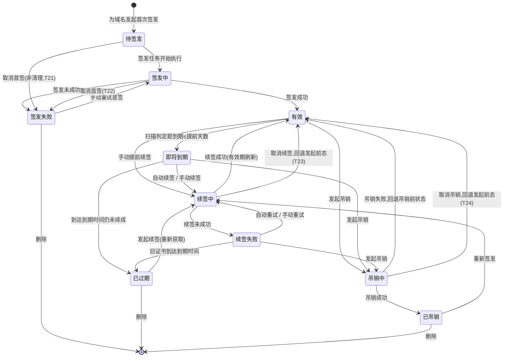

# 业务流程与状态机 · 证书管理(certificates)

> 文档状态: draft · 模块: certificates · 端点: app · 撰写: product-manager
> 信任基础: project.md(approved)§5/§6/§7/§9-D3 · roles.md(operator 全权)· glossary.md(术语引用不复述)
> **单一出现原则**:本文件定义**证书状态机**;dashboard / domains / tasks / acme / local-ca 等模块引用证书状态但**不复述**其定义与流转。

---

## 1. 模块职责与边界

本模块管理**证书本身的生命周期**:从发起签发、成为有效证书、随时间逼近到期、续签、失败告警、吊销到删除的全过程,以及把证书文件导出供用户自行部署。

### 1.1 本模块负责

- 维护每张证书的**当前状态**(见 §2 状态机)与有效期,启动即检测、定期扫描以驱动状态流转。
- 发起签发 / 续签 / 吊销 / 删除等动作,并根据执行结果推进证书状态。
- 导出证书文件(叶子证书 / 私钥 / 证书链)。

### 1.2 委托与消费(边界)

| 事项 | 归属模块 | 本模块的关系 |
| --- | --- | --- |
| 域名验证(挑战 / HTTP-01 / DNS-01)、ACME 账户 | `acme` | 签发 / 续签走公共 CA 时,把"证明域名控制权"整段**委托** acme 执行;本模块只关心验证是否通过与最终证书结果 |
| 用自签根 CA 签发内网证书 | `local-ca` | 签发方式选"自签"时,把签发动作**委托** local-ca;本模块只记录结果与状态 |
| 续签策略(提前天数 / 自动开关) | `settings` | **消费**策略,用于判定"即将到期"与是否自动续签;本模块不定义策略 |
| 签发 / 续签 / 吊销任务的队列、执行时间、日志、重试历史 | `tasks` | 本模块**触发**任务并依据任务结果更新证书状态;任务留痕与历史归 tasks,本模块不复述 |
| 红点 / 到期高亮 / 状态总览 | `dashboard` | 本模块**提供**证书状态数据;提醒呈现归 dashboard |
| 域名列表、域名与证书的关联 | `domains` | 证书必须关联已存在的域名;域名维护归 domains |

### 1.3 明确不做(遵 project §6.2 / §9-D3)

- ❌ 证书自动部署 / 安装到目标服务(导出后由用户自行部署)。
- ❌ 多渠道通知(仅提供状态供 dashboard 出红点)。
- ❌ DNS-01 厂商 API 自动验证(验证方式由 acme 承接,MVP 手动 DNS-01)。

---

## 2. 证书状态机(全局核心实体 · 仅此处定义)

一张**证书**代表"某组域名当前的证书"。续签成功不新建实体,而是**刷新同一证书**的有效期(见 §4 决策 DC1);历次执行留痕归 tasks。

### 2.1 状态定义

| 中文名 | 英文标识 | 含义(业务口径) | 性质 |
| --- | --- | --- | --- |
| 待签发 | `pending_issue` | 证书条目已创建(已关联域名与签发方式),首次签发任务已排队,尚未开始执行 | 初始 · 进行前 |
| 签发中 | `issuing` | 正在执行**首次**签发(委托 acme 验证域名 / 委托 local-ca 用根 CA 签发) | 进行中 |
| 签发失败 | `issue_failed` | 首次签发未成功(域名验证失败 / CA 拒绝 / 网络错误 / 自签失败) | 告警 · 需处理 |
| 有效 | `valid` | 已签发成功且在有效期内,距到期仍长于续签策略提前天数 | 稳态 |
| 即将到期 | `expiring_soon` | 距到期已不足续签策略提前天数(自动续签与红点提醒的触发条件) | 稳态 · 需关注 |
| 续签中 | `renewing` | 正在对已有证书执行续签(重新获取证书以延续有效期) | 进行中 |
| 续签失败 | `renewal_failed` | 续签未成功;旧证书可能仍在有效期内或已过期,需提醒并可重试 | 告警 · 需处理 |
| 已过期 | `expired` | 证书到达失效时间仍未成功续签,已不被信任 | 告警 · 需处理 |
| 吊销中 | `revoking` | 正在执行吊销(ACME 证书向 CA 发吊销请求 / 自签证书由根 CA 标记作废) | 进行中 |
| 已吊销 | `revoked` | 证书已被主动声明作废 | 终态(可删除 / 可重新签发) |

> 说明:未纳入"已删除"状态——删除后证书条目与本地文件一并移除、退出状态机,不作为一个可呈现的证书状态。

### 2.2 状态流转图

### 2.3 流转规则(权威定义)

| # | 源状态 | 触发事件 / 条件 | 目标状态 | 说明 |
| --- | --- | --- | --- | --- |
| T1 | (无) | 使用者为选定域名发起首次签发,创建证书条目 | 待签发 | 需已选定域名与签发方式(ACME / 自签) |
| T2 | 待签发 | 签发任务被 tasks 调度开始执行 | 签发中 | 首次签发 |
| T3 | 签发中 | 签发成功,取得证书文件与私钥并落地本地存储 | 有效 | 成功后由扫描按有效期与策略判定,可能立即转"即将到期" |
| T4 | 签发中 | 域名验证失败 / CA 拒绝 / 网络错误 / 自签失败 | 签发失败 | 失败原因由 tasks 记录日志 |
| T5 | 签发失败 | 使用者手动重试 | 签发中 | 重新走首次签发 |
| T6 | 有效 | 扫描检测到距到期 ≤ 续签策略提前天数 | 即将到期 | 提前天数取自 settings;启动即检测 + 定期扫描 |
| T7 | 有效 | 使用者手动续签(允许提前) | 续签中 | 手动续签不要求已"即将到期" |
| T8 | 有效 | 使用者发起吊销 | 吊销中 | |
| T9 | 即将到期 | 自动续签(策略开启且到达提前天数)或手动续签 | 续签中 | 自动续签动作由本模块响应策略触发 |
| T10 | 即将到期 | 到达到期时间仍未成功续签 | 已过期 | |
| T11 | 即将到期 | 使用者发起吊销 | 吊销中 | |
| T12 | 续签中 | 续签成功 | 有效 | 刷新同一证书条目的有效期与标识;成功后可能被扫描立即转"即将到期" |
| T13 | 续签中 | 续签未成功 | 续签失败 | |
| T14 | 续签失败 | 自动重试(策略)或使用者手动重试 | 续签中 | |
| T15 | 续签失败 | 旧证书到达到期时间 | 已过期 | 续签失败叠加到期,风险升级 |
| T16 | 续签失败 | 使用者发起吊销(旧证书尚在有效期内) | 吊销中 | |
| T17 | 已过期 | 使用者发起续签(重新获取证书) | 续签中 | 成功后回到"有效" |
| T18 | 吊销中 | 吊销成功(CA 确认 / 自签本地标记完成) | 已吊销 | |
| T19 | 吊销中 | 吊销失败(网络 / CA 拒绝) | 回退吊销前状态 | 回退至有效 / 即将到期 / 已过期 / 续签失败之一,并提示错误,证书维持原态 |
| T20 | 已吊销 | 使用者重新签发 | 续签中 | 为同域名重新获取一张证书(换新私钥) |
| T21 | 待签发 | operator 取消首签任务(非删除清理) | 签发失败 | 首签任务排队时被取消,尚无证书;保留条目、置签发失败(可重试 / 删除)。删除清理路径下随证书删除退出状态机(§3.6),不走此转移 |
| T22 | 签发中 | operator 取消首签任务 | 签发失败 | 首签任务执行中被取消(尽力而为,呼应 tasks TT6);无可用证书,置签发失败 |
| T23 | 续签中 | operator 取消续签任务 | 回退发起续签前态 | 回退至有效 / 即将到期 / 续签失败 / 已过期 / 已吊销之一(已吊销经 T20 重新签发进入续签中,取消则回退已吊销);旧证书仍在,与"续签失败但保留旧证书"同理 |
| T24 | 吊销中 | operator 取消吊销任务 | 回退发起吊销前态 | 回退至有效 / 即将到期 / 已过期 / 续签失败之一;证书未变,效果同 T19(吊销失败回退) |

### 2.4 跨状态动作(不改变状态)

| 动作 | 适用状态 | 说明 |
| --- | --- | --- |
| 导出 | 有效 / 即将到期 / 续签中 / 续签失败 / 已过期 / 已吊销 | 仅"本地已存在证书文件"的证书可导出;待签发 / 签发中 / 签发失败无文件不可导出 |
| 删除 | 待签发 / 签发失败 / 有效 / 即将到期 / 续签失败 / 已过期 / 已吊销 | 移除证书条目及本地文件,退出状态机;需二次确认;进行中态(签发中 / 续签中 / 吊销中)不可直接删除,须先等任务结束或经 tasks 取消 |
| 查看详情 | 全部状态 | 只读 |

---

## 3. 主业务流程

> 以下流程只描述**业务动作序列与模块委托**,不含界面细节(界面在页面 PRD)。所有"验证 / 挑战"步骤均委托 acme,所有"自签签发"步骤均委托 local-ca,所有"任务执行与留痕"均经 tasks。

### 3.1 首次签发

1. 使用者选定一个或多个已在 domains 存在的域名,选择签发方式:公共 ACME 或 自签根 CA。
2. 系统创建证书条目 → **待签发**;登记签发任务(tasks)。
3. 任务开始执行 → **签发中**:
   - 公共 ACME:委托 acme 执行域名验证(HTTP-01 或 DNS-01);验证通过后向 CA 取得证书。
   - 自签根 CA:委托 local-ca 用根 CA 直接签发。
4. 结果落地:
   - 成功:证书文件与私钥安全存储本地 → **有效**(扫描随后按有效期与策略判定,若已迫近到期则转"即将到期")。
   - 失败:→ **签发失败**,失败原因见 tasks 日志;使用者可手动重试。

> 通配符域名只能经 DNS-01 验证签发(glossary),签发方式选择时受此约束——具体交互在 acme / 页面 PRD 承接。

### 3.2 自动续签

1. 扫描判定某有效证书距到期 ≤ 续签策略提前天数 → **即将到期**,dashboard 出红点。
2. 若续签策略"自动"开启:本模块自动发起续签任务 → **续签中**(验证 / 签发同 §3.1 委托关系)。
3. 结果:
   - 成功 → **有效**,同一证书条目有效期刷新。
   - 失败 → **续签失败**,dashboard 出红点;按策略自动重试或等待人工重试。

### 3.3 手动续签

1. 使用者在有效 / 即将到期 / 续签失败 / 已过期状态下对证书发起续签(有效状态允许提前续)。
2. → **续签中**;流程同 §3.2 第 3 步。

### 3.4 续签失败处理

1. 证书处于 **续签失败**:使用者查看失败原因(日志详情由 tasks 承载)。
2. 处置分支:
   - 手动重试 → **续签中**。
   - 修正前置条件(如在 acme 更新验证方式 / 在 domains 修正域名)后重试。
   - 若旧证书在处置期间到期 → **已过期**,风险升级(仍可续签)。

### 3.5 吊销

1. 使用者对有效 / 即将到期 / 已过期 / 续签失败状态的证书发起吊销(如私钥泄露)。
2. → **吊销中**:
   - ACME 证书:向 CA 发吊销请求。
   - 自签证书:由 local-ca 的根 CA 标记作废。
3. 结果:
   - 成功 → **已吊销**。
   - 失败 → 回退吊销前状态并提示错误。
4. 已吊销证书可删除,或为同域名重新签发(→ 续签中,换新私钥)。

### 3.6 删除

1. 使用者对非进行中态的证书发起删除,二次确认。
2. 移除证书条目与其本地证书文件 / 私钥,退出状态机;与之关联的未完成任务由 tasks 一并取消 / 清理。
3. 进行中态(签发中 / 续签中 / 吊销中)需先等任务结束或经 tasks 取消后方可删除。

### 3.7 导出

1. 使用者对"本地已有证书文件"的证书发起导出。
2. 选择导出内容(叶子证书 / 私钥 / 证书链;具体可选项与格式在页面 PRD 展开)。
3. 交付:桌面形态可保存到本地路径,服务器形态为浏览器下载(形态差异)。
4. 私钥属敏感数据(project §7),导出私钥时需风险提示;导出为只读动作,不改变证书状态。

---

## 4. 决策记录(append-only)

> 只增不改;记"决定了什么 / 为什么不做另一选项"。模块 PRD 的决策记录与此互补(此处记流程 / 状态机相关决策)。

- **DC1(2026-07-16)· 续签刷新同一证书,不新建实体**:续签成功刷新同一证书条目的有效期与标识,而非每次续签生成新证书实体。
  - 为什么不新建:证书列表应呈现"每组域名的当前证书"当前态;历次执行留痕由 tasks 承担;每次续签新建会使列表膨胀并与 tasks 历史重复。
- **DC2(2026-07-16)· 保留"签发中 / 续签中 / 吊销中"过渡态**:三类在线操作各设进行中态。
  - 为什么:签发 / 续签 / 吊销均为可能失败的在线操作(ACME / CA 交互),使用者需看到"进行中"并在失败后重试;与 tasks 队列执行呼应。
- **DC3(2026-07-16)· 吊销失败不设独立告警态**:吊销失败回退吊销前状态 + 错误提示;而签发失败 / 续签失败设独立告警态。
  - 为什么:吊销失败后证书本身未变(仍有效),重试即可;签发 / 续签失败会使域名处于"缺可用新证书"的风险态,需独立提醒供 dashboard 出红点。
- **DC4(2026-07-16)· 首次用"签发中"、后续再获取统一用"续签中"**:仅"待签发 / 签发失败"进入签发中;即将到期 / 已过期 / 续签失败 / 已吊销触发的再获取统一进"续签中"。
  - 为什么:区分"第一次拿到证书"与"延续 / 重新获取"两类语义,便于告警与提醒差异化;避免同一目标状态承担多义。
- **DC5(2026-07-16)· 补齐"取消 → 证书回退"转移**:为证书状态机新增 T21–T24——待签发 / 签发中被取消置"签发失败"(T21 / T22);续签中 / 吊销中被取消回退到发起前态(T23 / T24)。此为 orchestrator 对 tasks Q1(取消 → 证书回退)的裁决结果(见 flows/tasks.md §4.4)。
  - 为什么这样回退:roles 把"取消任务"列为 operator 的独立操作(与删除是两回事),故取消需有独立于"删除清理"的证书落点。续签 / 吊销期间旧证书始终保留、取消未产出结果,证书理应回到发起前态——T23 与"续签失败但保留旧证书"同理,T24 效果与 T19(吊销失败回退)一致;首签尚无可用证书,取消置"签发失败"(可重试 / 删除)。删除清理路径(§3.6)下证书随之移除、不走 T21–T24。
