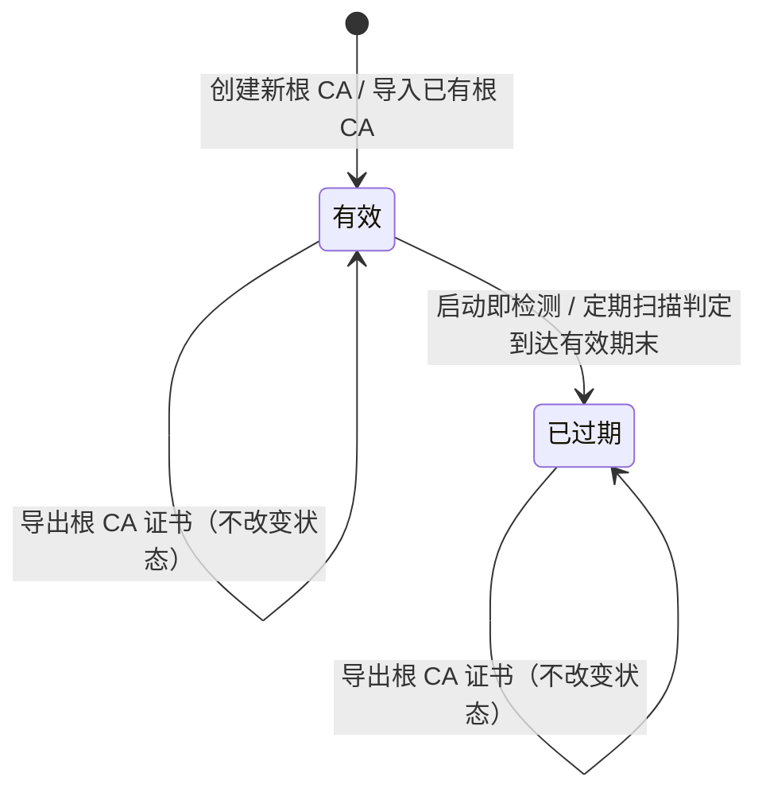

# 业务流程与状态机 · 自签根 CA(local-ca)

> 文档状态: draft · 模块: local-ca · 端点: app · 撰写: product-manager
> 信任基础: project.md(approved)§3/§5/§6/§7/§9-D3 · roles.md(operator 全权)· glossary.md(§1/§3 术语引用不复述)· flows/certificates.md + modules/certificates.md(证书状态机与"自签"委托关系据此对齐;即将 approved)
> **单一出现原则**:本文件定义**根 CA 状态机**;它签发出的**内网证书**是 certificates 实体,其状态走**证书状态机**(flows/certificates.md),本文件**引用不复述**。

---

## 1. 模块职责与边界

本模块管理**自签根 CA 本身的生命周期**:创建 / 导入根 CA、维护其有效性、导出根 CA 证书供客户端信任;并作为 certificates "自签"签发方式的**签发后端**,受其委托用根 CA 为域名签发内网证书、以及在吊销时把内网证书标记作废。

### 1.1 本模块负责

- 创建新的自签根 CA(本地生成密钥对并自签)或导入已有根 CA(根 CA 证书 + 配对私钥)。
- 维护每个根 CA 的**当前状态**(见 §2 状态机)与有效期,启动即检测、定期扫描以驱动状态流转。
- 导出根 CA 证书,供使用者导入客户端信任库(信任根 CA)。
- 作为 certificates 的"自签"签发后端:受委托用**有效**的根 CA 为目标域名签发内网证书;受委托把某内网证书由其签发根 CA 标记作废。

### 1.2 委托与消费(边界)

| 事项 | 归属模块 | 本模块的关系 |
| --- | --- | --- |
| 内网证书的生命周期、当前状态、有效期、列表 / 详情 / 导出 | `certificates` | 本模块**只负责签发动作与作废标记**并把结果交回;内网证书是 certificates 实体,其状态流转走**证书状态机**,本模块不创建证书实体、不设置证书状态、不复述证书状态机 |
| 发起"自签"签发 / 续签 / 吊销的触发与决策 | `certificates` | certificates 决定何时签发 / 吊销并**委托**本模块执行;本模块被动响应委托,不主动发起证书生命周期动作 |
| 域名列表、域名本体 | `domains` | 签发内网证书的目标域名来自 certificates 传入(其源为 domains);本模块不维护域名 |
| 签发 / 吊销的任务队列、执行时间、日志、重试历史 | `tasks` | "自签"签发 / 吊销经 tasks 调度与留痕(与 ACME 同一任务体系);本模块提供执行结果,不复述任务历史 |
| 根 CA 状态数据的总览呈现(如红点 / 提示) | `dashboard` | 本模块**提供**根 CA 状态数据;是否呈现、如何呈现归 dashboard |

### 1.3 明确不做(遵 project §5 / §6.2)

- ❌ 不管理内网证书的状态与生命周期(归 certificates,走证书状态机)。
- ❌ 不做根 CA 的自动续期 / 到期自动重建(见 §4-LC3)。
- ❌ 不做把根 CA **自动安装**到客户端信任库(导出后由使用者自行导入信任;对应 project §9-D3 "不自动部署"精神)。
- ❌ 不做多渠道通知(仅提供根 CA 状态供 dashboard)。

---

## 2. 根 CA 状态机(本模块定义 · 内网证书状态见 certificates)

一个**根 CA** 代表一份"用于内网签发的自签根证书"。本状态机只刻画**根 CA 自身**的生命周期,与它签出的内网证书状态相互独立(后者走证书状态机)。

### 2.1 状态定义

| 中文名 | 英文标识 | 含义(业务口径) | 性质 |
| --- | --- | --- | --- |
| 有效 | `active` | 根 CA 在有效期内:可用于签发内网证书、可导出供客户端信任 | 稳态 · 可签发 |
| 已过期 | `expired` | 根 CA 到达有效期末:**不可再用于签发新内网证书**(签出的链不被信任),仅可查看 / 导出以排查;提示使用者创建或导入新根 CA | 告警 · 需处理 |

> **进入前(非持久状态)**:"尚无根 CA" —— 模块内还没有任何根 CA(首次使用或全部根 CA 被替代后);它是进入状态机前的空条件,不是根 CA 实体的一个状态。
> **无"进行中"过渡态**:创建 / 导入是本地同步操作,瞬时完成,不设"创建中 / 导入中"(理由见 §4-LC1);对比 certificates 的"签发中 / 续签中"过渡态(在线 CA 交互可能失败)。

### 2.2 状态流转图

> 已过期为本实体的实际终态:自签根无法"续期还原",使用者以**创建 / 导入新根 CA**(一次新的进入)取而代之。是否支持**显式移除**根 CA 及如何处置其已签内网证书,见 §4-LC5(已裁决:MVP 不提供显式移除)。

### 2.3 流转规则(权威定义)

| # | 源状态 | 触发事件 / 条件 | 目标状态 | 说明 |
| --- | --- | --- | --- | --- |
| L1 | 尚无根 CA | 使用者创建新根 CA(本地生成密钥对并自签) | 有效 | 需提供名称、有效期等基本信息(§3.1) |
| L2 | 尚无根 CA | 使用者导入已有根 CA(提供根 CA 证书与配对私钥;私钥受口令保护时提供口令) | 有效 | 导入后与新建根 CA 等同可用(§3.2) |
| L3 | 有效 | 启动即检测 / 定期扫描判定根 CA 到达有效期末 | 已过期 | 到期后拒绝新的签发委托(见 §2.4 与 §3.4) |

### 2.4 跨状态动作(不改变根 CA 状态)

| 动作 | 适用状态 | 说明 |
| --- | --- | --- |
| 签发内网证书(受 certificates 委托) | 仅"有效" | 用根 CA 为目标域名签发内网证书;"已过期"根 CA 拒绝签发,certificates 据此记为"签发失败"(证书状态机);签出的内网证书走**证书状态机**,本模块不设置其状态(§3.4) |
| 标记内网证书作废(受 certificates 委托吊销) | 有效 / 已过期 | 由签发该内网证书的根 CA 记录其作废;内网证书的"吊销中 / 已吊销"态走**证书状态机**,本模块只提供作废标记与记录(§3.5) |
| 导出根 CA 证书 | 有效 / 已过期 | 导出根 CA 证书供客户端信任;只读,不改变状态;含私钥的备份 / 迁移导出见 §4-LC4(已裁决:MVP 不开放) |
| 查看根 CA 详情 | 有效 / 已过期 | 只读 |

---

## 3. 主业务流程

> 只描述**业务动作序列与模块委托**,不含界面细节(界面在页面 PRD)。所有涉及内网证书状态的结果均交回 certificates,由证书状态机承接;所有签发 / 吊销的任务留痕经 tasks。

### 3.1 创建根 CA

1. 使用者发起"创建根 CA",提供基本信息:根 CA 名称 / 标识、有效期(生效至失效)等(密钥算法等技术参数由 architect 定,不在业务契约)。
2. 本地生成密钥对并用其自签,产出一份新的根 CA(证书 + 私钥),私钥安全存储(project §7)。
3. 新根 CA 进入 **有效**,可立即用于签发内网证书与导出。
4. 该操作为**本地离线操作**(project §7 离线可用),无需外网;要么立即成功,要么立即失败(如参数非法),不产生过渡态。

### 3.2 导入根 CA

1. 使用者发起"导入根 CA",提供已有的根 CA 证书与其配对私钥;私钥受口令保护时提供解密口令。
2. 校验证书与私钥配对、证书为可用的根 CA;通过后落地存储(私钥安全存储,project §7)。
3. 导入的根 CA 进入 **有效**(若导入的证书本身已过有效期,则直接判为 **已过期**),与新建根 CA 等同参与后续流程。
4. 典型用途:把在别处已建立的根 CA 纳入 autohttps 统一签发;或在另一形态实例中沿用同一根 CA(两形态实例数据独立,project §4)。

### 3.3 导出根 CA 证书(供客户端信任)

1. 使用者对某根 CA(有效 / 已过期均可)发起导出。
2. 导出**根 CA 证书**(公开部分),供使用者在目标客户端 / 设备上导入信任库,完成**信任根 CA**(glossary §3),使该根 CA 签发的内网证书在该客户端被认可。
3. 交付:桌面形态可保存到本地路径,服务器形态为浏览器下载(形态差异,与 certificates §3.7 一致)。
4. 导出为只读动作,不改变根 CA 状态。含私钥的**备份 / 迁移导出**MVP 不提供,见 §4-LC4(已裁决)。

### 3.4 作为 certificates "自签"后端签发内网证书(委托衔接)

> 触发方来自 certificates:首次签发或续签选择"自签"方式时。certificates 侧证书状态为"签发中 / 续签中"(证书状态机),本模块只负责签发这一段。

1. certificates 委托本模块:用**指定的根 CA**为**一组目标域名**签发内网证书(域名集合来自 certificates,可含通配符域名)。
2. 本模块前置校验:目标根 CA 存在且处于 **有效**;若根 CA **已过期**或不可用,直接返回失败。
3. 校验通过:用该根 CA 为目标域名签发内网证书 —— 生成内网证书及其私钥,并用根 CA 签名,组装证书链(叶子内网证书 → 根 CA)。
4. 把签发结果(内网证书、其私钥、证书链)交回 certificates:
   - 成功:certificates 落地存储证书文件并推进证书状态(→ 有效,证书状态机),本模块记录"该根 CA 又签发了一张内网证书"的关联;
   - 失败(根 CA 已过期 / 私钥不可用 / 参数非法):certificates 记为"签发失败"(证书状态机),原因经 tasks 留痕。
5. 全过程为本地离线操作,不依赖外网(project §7);内网证书的有效期、后续续签 / 到期 / 吊销均由 certificates 按证书状态机管理,本模块不复述。

### 3.5 内网证书吊销的自签衔接(委托)

> 触发方来自 certificates:对一张"自签"内网证书发起吊销时(certificates §3.5)。certificates 侧证书状态为"吊销中 →(成功)已吊销"(证书状态机)。

1. certificates 委托本模块:把某张内网证书由其**签发根 CA**标记作废。
2. 本模块在该根 CA 名下记录该内网证书已作废(自签场景的作废记录;具体机制由 architect 定)。
3. 结果交回 certificates:
   - 成功:certificates 推进证书状态(吊销中 → 已吊销,证书状态机);
   - 失败:certificates 回退吊销前状态并提示(证书状态机,certificates §3.5 / DC3)。
4. 内网证书的吊销态由证书状态机承载,本模块只提供作废标记与记录,不复述证书状态。

### 3.6 根 CA 到期处理

1. 启动即检测 / 定期扫描判定某有效根 CA 到达有效期末 → **已过期**。
2. 已过期根 CA:拒绝新的签发委托(§3.4 第 2 步);仍可查看 / 导出以排查。
3. 处置:使用者**创建或导入新根 CA**(一次新的进入,§3.1 / §3.2)接替签发;此前用旧根 CA 签出的内网证书,其自身有效期与状态仍由证书状态机管理(它们会各自随自身有效期走向到期,与根 CA 到期是两件事)。
4. 提示:根 CA 到期会使其签出的内网证书因链根到期而不再被客户端信任 —— 此影响的呈现口径归 dashboard;本模块只提供根 CA 已过期这一状态事实。

---

## 4. 决策记录(append-only)

> 只增不改;记"决定了什么 / 为什么不做另一选项"。与 modules/local-ca.md §5 互补(此处记流程 / 状态机相关决策)。

- **LC1(2026-07-16)· 根 CA 无"进行中"过渡态**:创建 / 导入不设"创建中 / 导入中"状态。
  - 为什么不设:创建(本地生成密钥对 + 自签)与导入(校验 + 存储)都是**本地同步操作**,瞬时完成、无在线 CA 交互,要么立即成功要么立即失败;与 certificates 的"签发中 / 续签中"(在线 ACME 交互、可能长时间挂起并失败)本质不同,故不需要过渡态。契合 project §7 离线可用。
- **LC2(2026-07-16)· 内网证书状态走 certificates,不另立证书状态机**:本模块只定义根 CA 状态机;签出的内网证书是 certificates 实体。
  - 为什么不复述:单一出现原则;证书状态机若在两处各写一份,续签 / 到期 / 吊销规则一改就漂移。本模块与内网证书状态的唯一接触点是"签发结果 / 作废标记"交回 certificates。
- **LC3(2026-07-16)· 根 CA 仅"有效 / 已过期"两态,不设"即将到期 / 自动续期"**:MVP 不做根 CA 到期预警状态与自动续期。
  - 为什么不做:根 CA 有效期通常长达数年,到期低频;自签根"续期"等价于重建 + 用新根重签存量内网证书,复杂度与风险高,超出 task 明示范围。到期以扫描判定 + 提示使用者创建 / 导入新根覆盖;"即将到期预警"可后置增强(见 §4-LC6 备注)。
- **LC4(2026-07-16)· 导出仅公开根 CA 证书,不开放含私钥 / 迁移导出(MVP)**:task 明示导出用途是客户端信任(公开的根 CA 证书)。
  - 为什么谨慎:导出根 CA **私钥**属敏感操作(project §7),且与"根 CA 能否在两独立形态实例间迁移沿用"绑定(§3.2 第 4 步提到该场景)。**已裁决(orchestrator, 2026-07-16):MVP 仅导出公开根 CA 证书,不开放含私钥的导出 / 迁移导出。代价:根 CA 无法跨形态实例迁移沿用(后续可增量)。**
- **LC5(2026-07-16)· MVP 不提供显式移除根 CA**:task 未明示"删除 / 移除根 CA";状态机以"已过期后被新根接替"覆盖生命周期闭环。
  - 为什么不擅自加:移除一个已签发过内网证书的根 CA,会使其签出的内网证书链根缺失、无法验证,处置规则需业务拍板(禁止移除 / 允许但级联提示 / 仅允许移除无在用内网证书的根)。**已裁决(orchestrator, 2026-07-16):MVP 不提供显式移除根 CA,生命周期靠"过期后创建 / 导入新根接替"。代价:误建的根 CA 无法清理(后续可增量)。**
- **LC6(2026-07-16)· 支持多个根 CA 并存、统一管理**:本 flow 的状态机对"单个根 CA 实体"成立,与并存数量无关;并存数量决定模块呈现(单根管理页 vs 根 CA 列表)。
  - 默认取"支持多个根 CA、统一管理"(沿 project §3"根 CA 管理混乱 → 统一签发"的统一管理读法,及 certificates DS3"经哪个根 CA 签的"表述);单根 CA 是其子集。**已裁决(orchestrator, 2026-07-16):支持多个根 CA 并存、统一管理,不收敛为单根 CA。**
