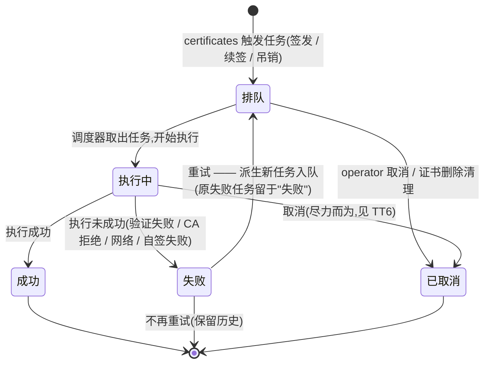

# 业务流程与状态机 · 任务与历史(tasks)

> 文档状态: draft · 模块: tasks · 端点: app · 撰写: product-manager
> 信任基础: project.md(approved)§5/§6/§7 · roles.md(operator 全权:查看历史 / 重试 / 取消任务)· glossary.md(术语引用不复述)· flows/certificates.md(证书状态机,orchestrator 指定为本阶段真相;**引用不复述**)· flows/settings.md(SF2 续签重试口径)
> **单一出现原则**:本文件定义**任务状态机**;dashboard / certificates / acme / local-ca / settings 等模块引用任务状态但**不复述**其定义与流转。证书状态机(待签发 / 签发中 / 有效 / 续签中 / 吊销中 …)定义在 flows/certificates.md,本文件引用其状态与转移编号(T1–T20)但**不复述定义**。

---

## 1. 模块职责与边界

本模块管理**任务本身的生命周期**:把 certificates 触发的"签发 / 续签 / 吊销"落成一次次**可排队、可执行、可失败、可重试、可取消、可留痕**的执行单元,并保存每次执行的时间、结果、日志与重试历史。

**任务(Task)与证书(Certificate)是两个不同实体**:证书是"被作用对象"(其状态与有效期归 certificates),任务是"对某张证书的一次执行单元"(其排队 / 执行 / 结果归本模块)。一张证书在其生命周期中会累积多次任务(首签、多次续签、失败重试、吊销……),形成执行历史。

### 1.1 本模块负责

- 维护每个任务的**当前状态**(见 §3 任务状态机)、任务类型、关联证书、触发方式、各时间点、执行结果与失败原因。
- 接收 certificates 的触发,将任务**入队**并按序**调度执行**;进程中断后启动即恢复未结束任务,不使其永久卡死。
- 保存每次执行的**执行日志**与**重试历史**(重试链),供查看与失败排查。
- 响应 operator 的**手动重试**与**取消**操作;响应 certificates 的**删除清理**(取消该证书未完成任务)。

### 1.2 委托与消费(边界)

| 事项 | 归属模块 | 本模块的关系 |
| --- | --- | --- |
| 证书本身的状态、有效期、是否"即将到期"、状态流转 | `certificates` | 本模块依任务执行结果**驱动** certificates 状态流转(见 §4);证书状态定义与真相归 certificates,本模块不复述、不改写 |
| 任务的触发决策(何时首签 / 何时自动续签 / 何时扫描再尝试 / 何时吊销) | `certificates`(+ `settings` 策略) | 本模块**接收**触发并执行;"是否 / 何时发起"由 certificates 依 settings 续签策略与周期扫描决定,本模块不自行判定证书是否到期、不持有扫描器 |
| 域名验证(挑战 / HTTP-01 / DNS-01)、ACME 账户 | `acme` | 签发 / 续签任务执行到"证明域名控制权"环节时,由 acme 承接;本模块记录该环节归属与结果引用,验证明细归 acme |
| 用自签根 CA 签发 / 吊销标记 | `local-ca` | 签发方式为自签时,签发 / 吊销的实际执行由 local-ca 承接;本模块记录结果 |
| 续签策略(提前天数 / 自动续签开关)、续签失败的自动再尝试口径 | `settings` | 本模块**消费**触发结果;自动再尝试依附 settings 自动续签开关下的 certificates 周期扫描(settings SF2:**无独立重试次数 / 间隔参数**),本模块不持有重试计时器 |
| 数据存储根路径 | `settings` | 任务历史落于 settings 定义的存储根路径下(settings §4);本模块不定义路径 |
| 红点 / 到期高亮 / 待处理清单 | `dashboard` | 本模块**提供**"某证书最近一次任务的结果与时间"供 dashboard 跳转排查(dashboard DS3);提醒呈现归 dashboard,本模块不出红点 |

### 1.3 明确不做(遵 project §6.2 / roles §4)

- ❌ 判定证书是否到期 / 是否即将到期、执行证书状态扫描(归 certificates)。
- ❌ 定义或存放续签策略、重试次数 / 间隔参数(策略归 settings,自动再尝试口径见 settings SF2)。
- ❌ 批量重试 / 批量取消等批量操作(需求未明示)。
- ❌ 跨证书的操作审计日志(谁在何时做了什么);本模块的"历史"聚焦签发 / 续签 / 吊销的**执行留痕**,操作审计后置(roles §4)。
- ❌ 多渠道通知(仅向 dashboard 提供数据出红点,project §6.2)。

---

## 2. 任务基本概念

### 2.1 任务类型

| 类型 | 英文标识 | 含义 | 由何触发 | 成功 / 失败驱动的证书转移 |
| --- | --- | --- | --- | --- |
| 签发任务 | `issue` | 为证书执行**首次**签发(取得该证书的第一张有效证书) | certificates 首次签发(T1)、签发失败后的重试 | 见 §4.1 |
| 续签任务 | `renew` | 对已有证书**重新获取**证书以延续有效期,或对已过期 / 已吊销证书**再获取** | certificates 手动续签(T7 / T9)、自动续签(T9)、续签失败再尝试(T14)、已过期续签(T17)、已吊销重新签发(T20) | 见 §4.2 |
| 吊销任务 | `revoke` | 主动声明某证书作废(ACME 证书向 CA 发吊销请求 / 自签证书由 local-ca 根 CA 标记作废) | certificates 发起吊销(T8 / T11 / T16) | 见 §4.3 |

> "再获取"(已过期 / 已吊销触发)统一归为**续签任务**,呼应 certificates DC4(首次用"签发中"、后续再获取统一用"续签中")。删除**不是任务**:删除无在线交互、即时完成,只会**取消**该证书未完成的任务(见 §5.5)。

### 2.2 触发方式

| 触发方式 | 英文标识 | 说明 | 适用类型 |
| --- | --- | --- | --- |
| 手动 | `manual` | operator 主动发起(在 certificates 发起签发 / 续签 / 吊销,或在本模块对失败任务点重试) | 签发 / 续签 / 吊销 |
| 自动(策略) | `auto` | certificates 依 settings 自动续签开关,在周期扫描中对"即将到期"发起续签、对"续签失败且未过期"再尝试续签(settings SF2) | 仅续签 |
| 清理 | `cleanup` | certificates 删除证书时,请求取消该证书未完成的任务(§5.5) | 取消动作,非新建执行 |

> **签发任务与吊销任务无自动触发**:首次签发失败只手动重试(certificates T5),吊销为 operator 主动动作、无自动语义。自动仅作用于续签(certificates T9 / T14)。

### 2.3 任务与证书的关系(概述,详见 §4)

- **多对一**:一张证书累积多个任务(历史);一个任务只作用于一张证书。
- **执行驱动状态**:任务从"排队 / 执行中"到"成功 / 失败",逐步驱动其关联证书在证书状态机上前进(见 §4 映射)。
- **单一执行单元**:每个任务是一次独立执行,拥有独立的时间 / 结果 / 日志;**重试不复用旧任务,而是派生新任务**(见 §6-DT1),重试历史即任务序列。

---

## 3. 任务状态机(本模块核心实体 · 仅此处定义)

### 3.1 状态定义

| 中文名 | 英文标识 | 含义(业务口径) | 性质 |
| --- | --- | --- | --- |
| 排队 | `queued` | 任务已创建入队,等待被调度执行;尚未开始执行 | 初始 · 进行前 |
| 执行中 | `running` | 任务正在执行(委托 acme 验证 / 与 CA 交互 / 委托 local-ca 签发 / 发吊销请求) | 进行中 |
| 成功 | `succeeded` | 任务执行成功并取得预期结果(取得证书 / 续签完成 / 吊销确认) | 终态 |
| 失败 | `failed` | 任务执行未成功(域名验证失败 / CA 拒绝 / 网络错误 / 自签失败);失败原因记入日志 | 终态 · 可重试(派生新任务) |
| 已取消 | `cancelled` | 任务在"排队"或"执行中"时被取消(operator 主动取消 / 证书删除清理) | 终态 |

> 三个终态(成功 / 失败 / 已取消)均不再改变自身状态。"失败可重试"指从失败任务**派生一个新任务**入队,原失败任务保持"失败"以留痕(§6-DT1)。

### 3.2 状态流转图

> 图中"失败 → 排队"为**派生关系**(重试创建一个新任务,新任务从"排队"起步,原失败任务停留"失败"终态),非同一任务回炉;详见 §3.3 TT7 与 §6-DT1。

### 3.3 流转规则(权威定义)

| # | 源状态 | 触发事件 / 条件 | 目标状态 | 说明 |
| --- | --- | --- | --- | --- |
| TT1 | (无) | certificates 触发一个任务(签发 / 续签 / 吊销),本模块创建任务并入队 | 排队 | 创建时确定:任务类型、关联证书、触发方式(手动 / 自动 / 清理) |
| TT2 | 排队 | 调度器取出任务开始执行 | 执行中 | 启动后优先处理遗留在队的排队任务;并发上限属实现(architect) |
| TT3 | 执行中 | 执行成功(取得证书 / 续签完成 / 吊销确认) | 成功 | 记录结束时间与结果;驱动证书状态(§4) |
| TT4 | 执行中 | 执行未成功(域名验证失败 / CA 拒绝 / 网络错误 / 自签失败) | 失败 | 失败原因写入执行日志;驱动证书告警态(§4) |
| TT5 | 排队 | operator 主动取消,或 certificates 删除证书触发清理 | 已取消 | 尚未执行,直接取消 |
| TT6 | 执行中 | operator 主动取消,或 certificates 删除证书触发清理 | 已取消 | **尽力而为**:已提交至 CA 的在途操作可能仍在对端生效,本模块以任务视角标记为已取消;实际结果由 certificates 下次扫描据实校正(§6-DT2) |
| TT7 | 失败 | operator 手动重试;或 certificates 依 settings 自动续签开关在周期扫描中对"续签失败且未过期"证书再次发起续签(仅续签) | (派生)排队 | **不复用原任务**:创建同类型、同证书的新任务入队,记录尝试序号与前序任务引用;原失败任务保持"失败" |

> **进程中断恢复(业务底线)**:进程异常中止后重启,遗留于"排队 / 执行中"的任务**不得永久停留**在进行前 / 进行中态。本模块启动时对其做恢复判定——重新排队执行,或校正为"失败"(可重试)。具体恢复策略(能否续跑在途执行、如何判定在途结果)由 architect 定,业务底线是"不卡死、可被 operator 看到并处置"。

---

## 4. 任务状态与证书状态的联动

> 本节说明**任务事件如何驱动 certificates 状态流转**。证书状态与转移编号(T1–T20)定义见 flows/certificates.md,此处仅引用其编号与方向,**不复述定义**。原则:任务是"因",证书状态变化是"果";证书状态机是唯一真相,本模块只触发流转、不改写其定义。

### 4.1 签发任务(issue)与证书状态

| 任务事件 | 驱动的证书转移(certificates) | 证书落点 |
| --- | --- | --- |
| 任务创建入队(TT1) | T1:为域名发起首次签发、创建证书条目 | 待签发 |
| 任务开始执行(TT2) | T2:签发任务被调度开始执行 | 签发中 |
| 任务成功(TT3) | T3:签发成功,证书文件与私钥落地 | 有效(扫描随后可能转"即将到期") |
| 任务失败(TT4) | T4:域名验证失败 / CA 拒绝 / 网络 / 自签失败 | 签发失败 |
| 手动重试(TT7 派生新签发任务,开始执行) | T5:签发失败 → 手动重试 | 签发中 |

> 签发任务的"排队 ↔ 待签发、执行中 ↔ 签发中"是一一对应(certificates 为首签保留了"待签发"前置态)。

### 4.2 续签任务(renew)与证书状态

| 任务事件 | 驱动的证书转移(certificates) | 证书落点 |
| --- | --- | --- |
| 任务创建并开始(TT1→TT2) | 视触发源:T7(有效→手动提前续)/ T9(即将到期→自动或手动续)/ T14(续签失败→自动或手动重试)/ T17(已过期→续)/ T20(已吊销→重新签发) | 续签中 |
| 任务成功(TT3) | T12:续签成功,刷新同一证书有效期(不新建证书,certificates DC1) | 有效(可能随即转"即将到期") |
| 任务失败(TT4) | T13:续签未成功 | 续签失败 |
| 自动再尝试(TT7:certificates 周期扫描再发续签) | T14:续签失败 → 自动重试 | 续签中 |

> 续签任务的"排队 / 执行中"两态均对应证书"续签中"(certificates 未为续签设独立前置态);旧证书在续签期间保留,失败或取消后仍是旧证书。**自动再尝试无独立重试参数**,依附 settings 自动续签开关下的周期扫描(settings SF2)。

### 4.3 吊销任务(revoke)与证书状态

| 任务事件 | 驱动的证书转移(certificates) | 证书落点 |
| --- | --- | --- |
| 任务创建并开始(TT1→TT2) | T8 / T11 / T16:对有效 / 即将到期 / 已过期 / 续签失败证书发起吊销 | 吊销中 |
| 任务成功(TT3) | T18:吊销成功(CA 确认 / 自签本地标记完成) | 已吊销 |
| 任务失败(TT4) | T19:吊销失败,回退吊销前状态并提示错误 | 回退至有效 / 即将到期 / 已过期 / 续签失败之一 |

### 4.4 取消的证书联动(边界说明)

取消改变的是**任务**状态(→ 已取消);证书的落点由 certificates 状态机承接,本模块**不定义证书转移**。业务意图上,取消等价于"该次执行未产出结果",证书应保持 / 回退到**任务发起前**的状态。certificates 已就此补齐"取消 → 证书回退"转移(flows/certificates.md T21–T24 / DC5,已裁决 orchestrator 2026-07-16),本模块引用不复述:

- **续签任务取消**:旧证书仍在,证书回退到发起续签前的 有效 / 即将到期 / 续签失败 / 已过期(certificates T23)。
- **吊销任务取消**:证书未变,回退吊销前状态,效果与 certificates T19(吊销失败回退)一致(certificates T24)。
- **签发任务取消**:该证书尚无任何可用证书。删除清理路径下证书随之移除退出状态机(§5.5,不走取消转移);若单独取消而保留证书条目,置签发失败(certificates T21 待签发→取消 / T22 签发中→取消)。

> 标准化"取消 → 证书回退"转移已由 certificates 补齐(T21–T24,见 flows/certificates.md §2.3 / §4-DC5);证书状态机为唯一真相,本模块只触发流转、不复述其定义。

---

## 5. 主业务流程

> 本节只描述**任务侧**的动作序列(入队 → 调度 → 执行 → 结果 → 留痕),证书侧流程见 flows/certificates.md §3,不重复。所有"验证 / 挑战"委托 acme,所有"自签签发 / 吊销标记"委托 local-ca。

### 5.1 任务的通用生命周期

1. certificates 触发签发 / 续签 / 吊销 → 本模块**创建任务并入队** → 排队(记录类型、关联证书、触发方式、入队时间)。
2. 调度器取出任务 → **执行中**(记录开始时间);执行中委托 acme 完成域名验证、委托 local-ca 完成自签、或与 CA 交互执行续签 / 吊销。
3. 执行结束:
   - 成功 → **成功**(记录结束时间、结果摘要);驱动证书转移(§4)。
   - 未成功 → **失败**(记录结束时间、失败原因、完整执行日志);驱动证书告警态(§4)。
4. 无论成败,该次执行作为一条**历史记录**长期留痕(除随证书删除的清理外,见 §5.5 与 §6-DT3)。

### 5.2 手动重试(operator 发起)

1. operator 在任务列表 / 详情看到一个**失败**任务(签发 / 续签 / 吊销均可),点击重试。
2. 本模块**派生一个新任务**(同类型、同证书、触发方式=手动),入队 → 排队;原失败任务保持"失败",新任务记录"第几次尝试 / 由哪个失败任务重试而来"(重试链)。
3. 新任务照 §5.1 执行,并驱动证书从其告警态回到进行中态(签发失败→签发中 T5 / 续签失败→续签中 T14 / 或对已回退证书重新发起吊销)。

### 5.3 自动续签与自动再尝试(certificates + settings 驱动)

1. certificates 周期扫描判定"即将到期",且 settings 自动续签开关开启 → certificates 发起自动续签 → 本模块收到触发,照 §5.1 执行续签任务。
2. 若续签失败(证书=续签失败且未过期),后续扫描周期 certificates 再次发起续签 → 本模块再执行一个新的续签任务(自动再尝试)。**无独立重试次数 / 间隔参数**,再尝试节奏依附扫描周期与自动续签开关(settings SF2)。
3. 自动续签开关关闭时:不产生自动续签 / 自动再尝试任务,续签完全依赖 operator 手动发起。

### 5.4 取消(operator 发起)

1. operator 对一个**排队**或**执行中**任务发起取消。
2. 排队任务:直接 → 已取消(TT5)。执行中任务:→ 已取消(TT6,尽力而为;在途 CA 操作可能仍生效,由 certificates 下次扫描校正)。
3. 证书侧回退 / 落点见 §4.4;标准化"取消 → 证书回退"转移已由 certificates 补齐(T21–T24,已裁决)。

### 5.5 删除清理(certificates 发起)

1. certificates 删除某证书时,对该证书**未完成(排队 / 执行中)的任务**请求清理 → 本模块将其取消(→ 已取消,触发方式=清理)。
2. 证书条目与本地文件由 certificates 移除、退出状态机(certificates §3.6);该证书的**历史任务记录保留为只读**("证书已删除"标注),不随证书级联删除(§6-DT3,已裁决)。
3. 进行中态证书(签发中 / 续签中 / 吊销中)必须先经本步取消任务,certificates 方可删除(certificates §2.4 / §3.6)。

---

## 6. 决策记录(append-only)

> 只增不改;记"决定了什么 / 为什么不做另一选项"。模块 PRD 的决策记录与此互补(此处记流程 / 状态机 / 联动相关决策)。

- **DT1(2026-07-16)· 任务是一次执行单元,重试派生新任务**:失败任务不回炉复用,重试创建同类型、同证书的新任务,原失败任务保持"失败"终态;重试历史即任务序列(重试链)。
  - 为什么不回炉:每次执行有独立的时间 / 结果 / 日志,回炉会让一个任务混杂多次尝试、历史含糊;派生新任务使"某证书第 N 次签发 / 续签为何失败"逐条可查,呼应 certificates DC1(证书刷新、历次执行由 tasks 留痕)。
- **DT2(2026-07-16)· 进行中取消为"尽力而为"**:排队任务可直接取消;执行中任务允许取消,但已提交至 CA 的在途操作不保证中断,任务侧标记已取消,实际结果由 certificates 下次扫描据实校正。
  - 为什么不保证强中断:签发 / 续签 / 吊销含外部 CA 交互,客户端单方面取消无法回收对端已受理的操作;强行承诺"取消即无副作用"会误导。以"尽力取消 + 扫描校正"兜底更诚实,且 certificates 已具备扫描校正能力。
- **DT3(2026-07-16)· 证书删除后任务历史保留为只读**:删除证书取消其未完成任务;历史任务记录不级联删除,以只读("证书已删除"标注)保留。
  - 为什么不级联:tasks 模块职责即"执行历史留痕"(project §5),级联删除会丢失"某证书曾如何签发 / 失败"的历史价值;只读保留避免对已删证书误触发重试。**已裁决(orchestrator, 2026-07-16):证书删除后任务历史保留为只读,不级联删除。**
- **DT4(2026-07-16)· 自动仅作用于续签,签发 / 吊销为手动**:自动续签与自动再尝试仅针对续签任务(certificates T9 / T14);首次签发失败只手动重试(T5),吊销为 operator 主动动作、无自动。
  - 为什么:首签由 operator 显式发起,失败自动重试可能反复撞同一未修正的前置错误(如域名未配好),不宜自动;吊销是不可逆的主动声明,无自动语义。
- **DT5(2026-07-16)· 不持有续签重试参数与扫描器**:自动再尝试节奏依附 settings 自动续签开关下的 certificates 周期扫描(settings SF2:无独立重试次数 / 间隔),本模块不设"重试次数 / 间隔"配置、不自行扫描证书到期。
  - 为什么:避免与 settings / certificates 出现双策略源;策略唯一定义点是 settings、到期扫描唯一执行者是 certificates,tasks 专注"执行 + 留痕"。

---

## 裁决记录(原待澄清项 · orchestrator 2026-07-16)

- **Q1(已裁决 orchestrator 2026-07-16)· 标准化"取消 → 证书回退"转移**:采纳"补充取消转移"方案——certificates 已在证书状态机补齐 T21–T24(待签发 / 签发中 → 取消 → 签发失败;续签中 / 吊销中 → 取消 → 回退发起前态),见 flows/certificates.md §2.3 / §4-DC5。本模块任务侧取消(TT5 / TT6)驱动这些证书转移,引用不复述;§4.4 已据此对齐。
- **Q2(已裁决 orchestrator 2026-07-16)· 删除证书后任务历史的处置**:保留为只读、不级联删除(DT3 / modules DEC3)。为什么:保全"执行历史留痕"职责(project §5);清理 / 隐私诉求后续确需再增量。
